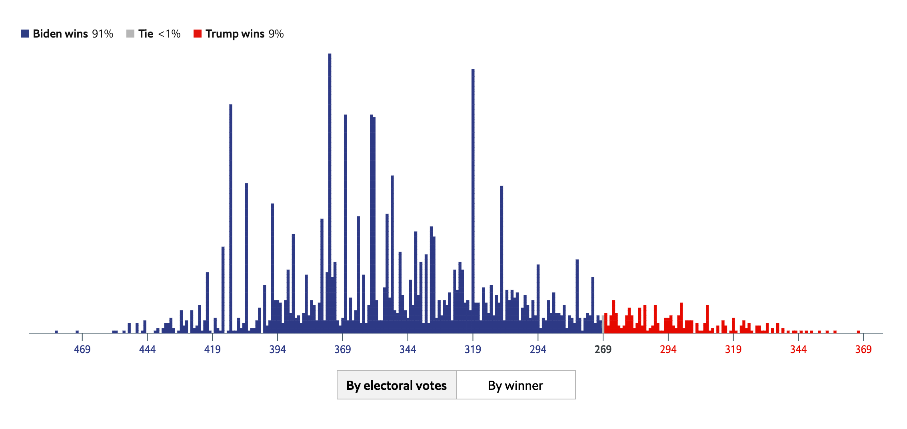

---
output_yaml:
  - _output.yml
---

# Probability

<!-- 1) No orphan parantheses. Meaning no ) by itself and no ( with nothing after. -->

<!-- 2) "Do you have disease?" on Y- axis instead. The data here is: What does your test show? The two models are: You have the disease and you don't have the disease. -->

<!-- 3) Maybe switch the graph making package to [daggity](https://CRAN.R-project.org/package=dagitty)? I think that dagitty() would do the same as your package. I hate having to install a bioconductor package.  -->

<!-- 4) Define the mathematical distribution of electoral college votes as the distribution which results from running the following calculation 10,000 times. Take the vector ev of electoral college votes, which is an integer vector of length 51. (Use the current value, don't worry about the past.) Multiple this vector, element-by-element, with `rbinom(length(ev), size = 1, p = 0.5)`. Sum the resulting vector. Code:  `ev %*% rbinom(length(ev), size = 1, p = 0.5)` Doing this once gives you the total electoral votes for the Democrat in that one simulation. -->

```{r}
# ev <- c(12, 23, 2, 4, 25, 3, 34, 12, 26, 34)
# sims <- 10000
# 
# result <- tibble(total = (matrix(rbinom(sims*length(ev), 
#                         size = 1, p = 0.5), 
#                  ncol = length(ev)) %*% ev)[,1])
# 
# ggplot(data = result, aes(total)) +
#   geom_histogram(binwidth = 1)
  
```


<!-- Add 4th subsubpart to first part explaining Joint Distributions. Do this at the end of probability distribution part.  Example is one die with 50% likelihood of coming up 6 (and other faces at 10%) and second die 50% likelihood. Don't only care about the total. In this situation, you need a 3d plot. p(A, B) is p(Result of Die 1, Result of Die 2). Just one empirical plot of 100 roles. -->

<!-- A probability distribution is an object with a domain of outcomes, example: sum of two die. (You don't care which die has what value.) Another example, result of two die and you care which die came which way. Each element in the domain is *mapped* to a probability value, which is a number between 0 and 1 inclusive. The sum of all the mappings equals 1. -->


<!-- 3) Adding three model example. -->

<!-- 6) More animations -->


<!-- Other Stuff -->

<!-- DK: heads or Heads? -->

<!-- DK: It is clear that the concept of a posterior is tricky. So, after each of our three examples, we need to discuss what the posterior means. Recall: The posterior is our belief about the future. The two most common ways to think about this: First, what will the next roll of the dice bring? Most likely outcome is a 2. But there is a 15% chance of a 3. There is a 5% chance of a 7 or an 11. And so on. Second, what would the empirical distribution look like if we rolled the dice 10,000 times. Again, these are the same things, almost by definition. But they are different conceptions, both of which you should explain each time. -->

<!-- DK: We need a single example of a continuous distribution after Electoral Votes. It will also have math. And empirical. And posterior. -->

<!-- DK: We need an example of an unnormalized posterior in the first section. -->

<!-- Zoom with Tahmid and make sure that he understands the posterior distribution and that you agree with how he describes the posterior distribution in chapter 7. Will students understand his description, even though the last time they thought about this was two weeks earlier in your chapter. -->


<!-- 4)  -->
<!-- - Workshop statistics quote + generally populate sidebar -->
<!-- - Add Rossman quote to side. -->
<!-- - More quotes and fun stuff. -->


<!-- DK: Things to discuss 


2) Don't use grid.arrange. Use the functions in cowplot. Or is there a better package?

DK: If we want to do rethinking: https://bookdown.org/content/3890/small-worlds-and-large-worlds.html#the-garden-of-forking-data

-->

<!-- Outline: -->

<!-- 1) Probability Distributions (3 subparts; 4th part which shows how math (if true) looks like the empirical distribution, with big enough N.) -->

<!-- 2) Tree Diagrams -->

<!-- 3) Two Models -->

<!-- 4) Three Models -->

<!-- 5) N Models (with coin example) -->


<!-- Key references. Make sure to cite all three as separate side notes. But, at the same time, don't feel compelled to do things the way that they did them. -->

<!-- 2) Teaching Bayes' Rule: A Data-Oriented Approach by Jim Albert. The key concept is Bayes Scatterplots. That is the central graphic of this chapter. We will show such a scatterplot four or five times, each time more complex, each time showing marginal distributions in both directions. -->

<!-- 3) Rethinking Chapter 2. Garden of forking data is just excellent stuff.  -->

<!-- Open Questions: -->

<!-- Use some STAT 110 midterm questions as example problems which simulation makes easy to solve. Maybe? At least in the first section? https://projects.iq.harvard.edu/files/stat110/files/midterm_exam.pdf -->

<!-- Class Exercises -->

<!-- a) Workshop Statistics has nice dice and coin examples. Perhaps use those in lecture? -->

<!-- b) Two buckets, each with different pair of die in them: one normal, one weird. You pick a bucket, then roll the die. Q: What are the odds of bucket 1 versus bucket 2? Start with dice function. Then build tibble as in the cookie problem. That takes a day, especially if we build the result by-hand, meaning pivot_wider and summing columns, as we should. Then, day 2, place a prior on the two buckets. Then, what if we through the dice more than once? This will be a list column. Scary! But all the other arguments go through. (I think!) Then, discuss continuous example of a coin, setting the stage for problem set question. -->

<!-- c) Do a dice example where students each have their own priors and then we update after rolling dice, some fake or real. Do it with counts, not proportions.  -->

<!-- d) Might a Bayesian power discussion, as in Kruscke article, be a useful problem set? Ties into the usage of fake data. Good way to introduce/teach type M and S errors? -->


```{r include=FALSE}
# Need scales::comma for formatting. This is an example of a package which
# should be included once, at the start of making the book. Use ggthemes so we
# can use theme_tufte for our plots!

# DK: Why Rgraphviz and not one of the other tree packages? It is a giant bother
# to deal with a Bioconductor package.

library(scales)
library(ggthemes)
library(Rgraphviz)
library(infer)
library(tufte)
library(tidyverse)

# invalidate cache when the tufte version changes

knitr::opts_chunk$set(tidy = FALSE, cache.extra = packageVersion('tufte'))
```

The central tension, and opportunity, in data science is the interplay between the *data* and the *science*, between our empirical observations and the models which we use to understand them. Probability is the language we use to explore that interplay; it connects models to data, and data to models.

## Probability Distributions

<!-- Read Topic 14 in Bayesian Workshop. Lots of interesting ideas and examples there for this first section of the chapter. Any coding examples should be simple, with  no list-columns and map_* functions. Basic tool we are introducing is doing simulation within a tibble. Consider doing some of the sample problems from STAT 110, many of which are hard to do analytically but easy to do with simulation. -->


```{r, echo=FALSE, fig.margin=TRUE, fig.cap="Dice and Probability."}

knitr::include_graphics("05-probability/images/probability_dice.jpeg")

```

```{marginfigure}

The opening paragraph of *Workshop Statistics:  Discovery with Data, A Bayesian Approach by James H. Albert and Allan J. Rossman* does a wonderful job of explaining the concept of probability.

  "In the activities to follow, we don’t know if we have a particular disease, if a die being used in the casino is fair, the exact number of fish in our backyard pond, or the number of defectives in a shipment of electronic components. A model is a possible description of this unknown phenomena. In each application, there will be a number of possible models. We assign prior probabilities to these models — these probabilities reflect our opinions about which models are more or less likely to be true. To learn about the correct model, data will be observed. In the activities, the data will consist of the results of a blood test, the results of a roll of the die, the results of a capture-recapture experiment, and the number of defectives observed in a sample. This data will change our opinions about the likelihoods of the different models. Bayes’ rule is the formula which tells us how to compute the new model probabilities."

```

What does it mean that Trump has a *30% chance* of winning re-election this fall? That there is a *90% probability* of rain today? That the die at the casino is *unfair*? If I roll that die 10 times and five of those times I get a three, how likely is it that the die is *unfair*?

Probability is about quantifying uncertainty. We can think of probability as a proportion. The probability of an event occurring is a number from 0 to 1, where 1 means that the event is 100% certain. Throughout this chapter, we will use p() to denote probability distributions. 

Let's begin with the simplest events: coin flips and dice rolls. If the die and 
the coins are fair, we can operate under the assumption that all outcomes are 
equally likely. 

This allows us to make the following statements:

* The p(rolling 1 or 2) is 2/6, or 1/3.  
* The p(rolling 1, 2, 3, 4, 5, or 6) is 1.  
* The p(flipping a coin and getting tails) is 1/2.

<!-- Be precise about technical terms: outcome and domain. Be more smooth. -->

For the purposes of this course, a *probability distribution* is a mathematical object that covers a set of outcomes, where each distinct outcome has a chance of occurring between 0 and 1. The sum of all chances equals to 1. The set of possible outcomes --- heads or tails for the coin, 1 through 6 for the die --- can be either discrete or continuous. This set of possible outcomes is the *domain* of the probability distribution. There are three types of probability distributions: mathematical, empirical, and posterior. Let's walk through some examples to better understand each type of probability distribution.

### Flipping a coin.

A *mathematical distribution* is based on mathematical formulas. Assuming that the dice is perfectly fair, we should get heads as many times as we get tails.

```{r, echo = FALSE}

# Flipping one coin 100 times

mydata <- tibble(results = c(rep(0, 50),
                             rep(1, 50)))

ggplot(mydata, aes(x = results)) +
  geom_histogram(aes(y = ..count../sum(..count..)), 
                 binwidth = 0.5, 
                 fill = "dark gray", color = "white") +
  labs(title = "Mathematical Probability Distribution",
       subtitle = "Flipping One Coin",
       x = "Outcomes",
       y = "Probability") +
  scale_x_continuous(breaks = seq(0,1,1), labels = c("Heads", "Tails"))

```

An *empirical distribution* is based on data. You can think of this as the probability distribution created by running a simulation. In theory, if we increase the number of coins we flip in our simulation, the empirical distribution will look more and more similar to the mathematical distribution. The probability distribution is the Platonic form. The empirical distribution will often look like the mathematical probability distribution, but it will rarely be exactly the same.

In this simulation, there are 49 heads and 51 tails. The outcome will vary every time we run the simulation, but the proportion of heads to tails should not be too different if this coin is fair.

```{r, echo = FALSE}

# Flipping one coin 100 times

set.seed(2)

coin <- c(0, 1)

sims <- 100

results <- sample(coin, sims, replace=TRUE)

mydata <- tibble(results)

ggplot(mydata, aes(x = results)) +
  geom_histogram(aes(y=..count../sum(..count..)), binwidth = 0.5, 
                 fill = "dark gray", color = "white") +
  labs(title = "Empirical Probability Distribution",
       subtitle = "Flipping One Coin A Hundred Times",
       x = "Outcomes",
       y = "Probability") +
  scale_x_continuous(breaks = seq(0,1,1), labels = c("Heads", "Tails"))

```

An *posterior distribution* is based on beliefs and expectations. It displays your belief about things you can't see right now. You may have posterior distributions for events in the past, present, or future.

In the case of the coin toss, the posterior distribution changes depending on your beliefs. For instance, let's say your friend brought a coin to school and asked to bet you. If the result is heads, you have to pay them $5. This makes you suspicious; your posterior distribution would reflect this. You might believe that p(Heads) is 0.95 while p(Tails) is 0.05.

```{r, echo = FALSE}

# Flipping one coin 100 times

mydata <- tibble(
  results = c(
    rep(0, 95),
    rep(1, 5)
))

ggplot(mydata, aes(x = results)) +
  geom_histogram(aes(y=..count../sum(..count..)), binwidth = 0.5, 
                 fill = "dark gray", color = "white") +
  labs(title = "Posterior Probability Distribution",
       subtitle = "Flipping One Coin to Bet Your Friend",
       x = "Outcomes",
       y = "Probability") +
  scale_x_continuous(breaks = seq(0,1,1), labels = c("Heads", "Tails"))

```

### Rolling two die.

Our *mathematical distribution* tells us that, with a fair dice, the probability of getting 1, 2, 3, 4, 5, and 6 are equal: there is a 1/6 chance of each. When we roll two die at the same time and sum the values, the numbers closes to the middle (ex. 6, 7, 8) are more common sums than numbers at the very edge (ex. 2, 12) because there are more combinations of numbers that add up to the middle values.

```{r, echo=FALSE}

set.seed(1)

dice <- c(1:6)

sims <- 10000000

mydata <- tibble(dice_1 = sample(dice, size = sims, replace = TRUE),
                 dice_2 = sample(dice, size = sims, replace = TRUE))

mydata <- mydata %>%
  mutate(sum = (dice_1 + dice_2))

ggplot(mydata, aes(x = sum)) +
  geom_histogram(aes(y=..count../sum(..count..)), binwidth = 1, 
                 fill = "dark gray", color = "white") +
  labs(title = "Mathematical Probability Distribution",
       subtitle = "Sums from Rolling Two",
       x = "Outcomes",
       y = "Probability") +
  scale_x_continuous(breaks = seq(0,12,1), labels = 0:12) +
  theme_classic()

```

We get an *empirical distribution* by running a simulation and rolling two die a hundred times. The result is not as perfect and even as the mathematical distribution, but we can observe that the p(2) and p(12), which are displayed on the left and right most ends of the distribution, are far lower than the p(values near the center of the distribution).

```{r, echo=FALSE}

# Two die rolled 100 times

set.seed(1)

dice <- c(1:6)

sims <- 100

mydata <- tibble(dice_1 = sample(dice, size = sims, replace = TRUE),
                 dice_2 = sample(dice, size = sims, replace = TRUE))

mydata <- mydata %>%
  mutate(sum = (dice_1 + dice_2))

ggplot(mydata, aes(x = sum)) +
  geom_histogram(aes(y=..count../sum(..count..)), binwidth = 1, 
                 fill = "dark gray", color = "white") +
  labs(title = "Empirical Probability Distribution",
       subtitle = "Sums from Rolling Two Die A Hundred Times",
       x = "Outcomes",
       y = "Probability") +
  scale_x_continuous(breaks = seq(0,12,1), labels = 0:12) +
  theme_classic()

```

The *posterior distribution* for rolling one dice a hundred times will vary based on your expectations. If you take the dice from your Monopoly set, you have reason to believe that the mathematical distribution is true. However, if you walk into a crooked casino and a host asks you to play craps, you might be suspicious. You win by rolling 7's and 11's. You might expect those numbers to very rarely occur. You might also expect values like 2, which are statistically less probable, to occur more frequently.

```{r, echo=FALSE}

# Flipping a dice 100 times

mydata <- tibble(
  results = c(
    rep(2, 30),
    rep(3, 15),
    rep(4, 15),
    rep(5, 3),
    rep(6, 2),
    rep(7, 1),
    rep(8, 5),
    rep(9, 5),
    rep(10, 5),
    rep(11,1),
    rep(12,3)
))

ggplot(mydata, aes(x = results)) +
  geom_histogram(aes(y=..count../sum(..count..)), binwidth = 0.5, 
                 fill = "dark gray", color = "white") +
  labs(title = "Posterior Probability Distribution",
       subtitle = "Rolling Two Die at a Crooked Casino",
       x = "Outcomes",
       y = "Probability") +
  scale_x_continuous(breaks = seq(0,12,1), labels = 0:12) +
  theme_classic()

```
### Presidential Elections

Now we let's say we are building probability distributions for political events, like a presidential election. We want to know p(Candidate A wins the election).

It would be incredibly naive to create the following *mathematical distribution*.

```{r, echo = FALSE}

# Flipping one coin 100 times

mydata <- tibble(results = c(rep(0, 50),
                             rep(1, 50)))

ggplot(mydata, aes(x = results)) +
  geom_histogram(aes(y=..count../sum(..count..)), binwidth = 0.5, 
                 fill = "dark gray", color = "white") +
  labs(title = "Mathematical Probability Distribution",
       subtitle = "Probability of Parties Winning",
       x = "Outcomes",
       y = "Probability") +
  scale_x_continuous(breaks = seq(0,1,1), labels = c("Republicans", "Democrats"))

```
We know that campaign platforms, donations, charisma, and many other factors will contribute to a candidate's likeability. Elections are more complicated than coin tosses. Some polticial scientists may try to create algorithms to calculate mathematical probability distributions.

The *empirical distribution* in this case could involve looking into past elections in the United States and counting the number of elections that each party has won. Perhaps we're interested specifically in the electoral votes that the Democrats receive. For the empirical distribution, we would create a tibble from past elections. Looking at elections since 1964, we can observe that the number of electoral votes that the Democrats received in each one is different. Given that we only have 14 entries, it is difficult to draw conclusions or make predictions based off of this empirical distribution.

```{r, echo = FALSE}

mydata <- tibble(
  electoral_votes = c(486,191,17,297,49,13,111,370,379,
                      271,286,365,332,304))

ggplot(mydata, aes(x = electoral_votes)) +
  geom_histogram(aes(y=..count../sum(..count..)), bins = 100, fill = "light blue", color = "white") +
  labs(title = "Mathematical Probability Distribution",
       subtitle = "Probability of Parties Winning",
       x = "Outcomes",
       y = "Probability")

```

The *posterior distribution* in the election case is something many data scientists actually devote a lot of time to. Consider this projection from The Economist, which uses various assumptions to generate a forecast. The analysts have developed an algorithm that considers their expectations for each outcome. In this case, the analysts at the Economist have chosen to merge two axes (i.e. the number of Republican votes and the number of Democrat votes) together.

```{r, echo=FALSE, fig.fullwidth = TRUE}



```

There are many political science questions you could explore with posterior distributions and they can relate to the past, present, and future.

* Past: How many electoral votes would Hilary Clinton have won if she picked a different VP?
* Present: What is the median height of Harvard students?
* Future: How many electoral votes will a presidential candidate win?

<!-- We need a continuous distribution. -->

## Tree Diagrams

### Independence

So far, you have learned how to calculate P(A), which is the fancy, statistical way of saying the probability of an event. When flipping a coin, the probability of getting heads was 1/2. You have also learned how to compute the P(A or B). This means the probability of either A or B happening. When rolling a dice, P(1 or 2)--the probability of getting a 1 or a 2--was 1/3.

What if you flipped 2 coins? You know that the probability of getting heads once is 1/2, but what are the odds of getting heads 2 times in a row? Let's take a look at this tree diagram. We read this diagram from left to right. On the left, the probability of getting heads is 0.5. Now the tree branches out.

* *If* we got heads the first time, then we go up the top branch. The probability of getting heads again is 0.5.
* *If* we got tails the first time, then we go down the bottom branch. The probability of getting heads is 0.5.

Notice how regardless of what we get the first time we flip the coin, the probability of getting heads is 0.5 throughout. This suggests that the coin flips are **independent**. The result of one coin flip does not impact the likelihood of getting the same result next time. Take a look at the tree diagram. P(H given H) represents the probability of getting heads *given* that we got heads the first time. P(H given T) represents the probability of getting heads *given* that we got tails the first time. P(H given H) = P(H given T).

```{r, echo=FALSE}

# Probability of a

a <- 0.5

# Probability of (b | a)

bGivena <- 0.5

# Probability of (b | not a)

bGivenNota <- 0.5

# Calculate the rest of the values based upon the 3 variables above
notbGivena<-1-bGivena
notA<-1-a
notbGivenNota<-1-bGivenNota
 
#Joint Probabilities of a and B, a and notb, nota and b, nota and notb
aANDb<-a*bGivena
aANDnotb<-a*notbGivena
notaANDb <- notA*bGivenNota
notaANDnotb <- notA*notbGivenNota
 
# Probability of B
b <- aANDb + notaANDb
notB <- 1-b
 
# Bayes theorum - probability of A | B
# (a | b) = Prob (a AND b) / prob (b)
aGivenb <- aANDb / b
 
# These are the labels of the nodes on the graph
# To signify "Not A" - we use A' or A prime 
 
node1<-"P"
node2<-"P(H)"
node3<-"P(T)"
node4<-"P(H given H)"
node5<-"P(T given H)"
node6<-"P(H given T)"
node7<-"P(T given T)"
nodeNames<-c(node1,node2,node3,node4,node5,node6,node7)

rEG <- new("graphNEL", nodes=nodeNames, edgemode="directed")
 
# Draw the "lines" or "branches" of the probability Tree
rEG <- addEdge(nodeNames[1], nodeNames[2], rEG, 1)
rEG <- addEdge(nodeNames[1], nodeNames[3], rEG, 1)
rEG <- addEdge(nodeNames[2], nodeNames[4], rEG, 1)
rEG <- addEdge(nodeNames[2], nodeNames[5], rEG, 1)
rEG <- addEdge(nodeNames[3], nodeNames[6], rEG, 1)
rEG <- addEdge(nodeNames[3], nodeNames[7], rEG, 10)
 
eAttrs <- list()
 
q <- edgeNames(rEG)
 
# Add the probability values to the the branch lines
 
eAttrs$label <- c(toString(a),toString(notA),
 toString(bGivena), toString(notbGivena),
 toString(bGivenNota), toString(notbGivenNota))
names(eAttrs$label) <- c(q[1],q[2], q[3], q[4], q[5], q[6])
edgeAttrs<-eAttrs
 
# Set the color, etc, of the tree

attributes<-list(node=list(label="foo", fillcolor="light blue", fontsize="12"),
 edge=list(color="blue"),graph=list(rankdir="LR"))
 
#Plot the probability tree using Rgraphviz

plot(rEG, edgeAttrs=eAttrs, attrs=attributes)

```

### Conditional probability

Now imagine that 60% of people in a community have a disease. A doctor develops a test to determine if a random person has the disease. However, this test isn't 100% accurate. This test is 80% sure of correctly returning positive **if the person has the disease** and 90% sure of correctly returning negative **if the person does not have the disease**.

This tree diagram illustrates exactly this. Starting from the left, we see that the probability of a random person having the disease is 0.6. Since they either have the disease or don't (those are the only two possibilities), the probability that they don't have the disease is 1 - 0.4.

Now the tree branches out.

* *If* the random person has the disease, then we go down the top branch. The probability of the person testing positive is 0.8 because the test is 80% sure of correctly returning positive when the person has the disease.
* By the same logic, *if* the random person does not have the disease, we go down the bottom branch. The probability of the person incorrectly testing positive is 0.1.

We decide to go down the top branch *if* our random person has the disease. We go down the bottom branch *if* they do not. This is called **conditional probability**. The probability of testing positive is **dependent** on whether the person has the disease.

How would you express this in statistical notation? p(A|B) is the same thing as the probability of A *given* B. p(A|B) essentially means the probability of A *if* we know for sure that B is true. You should also remember that p(A|B) is not the same thing as p(B|A).

```{marginfigure}
**Positive:** The test results suggest that the patient has the disease.

**False Positive:** The patient does not have the disease but the test results incorrectly suggest that they do.

**Negative:** The test results suggest that the patient does not have the disease.

**False Negative:** The patient has the disease but the test results incorrectly suggest that they do not.

```

```{r, echo=FALSE}

# Probability of a

a <- 0.6

# Probability of (b | a)

bGivena <- 0.8

# Probability of (b | not a)

bGivenNota <- 0.1

# Calculate the rest of the values based upon the 3 variables above
notbGivena<-1-bGivena
notA<-1-a
notbGivenNota<-1-bGivenNota
 
#Joint Probabilities of a and B, a and notb, nota and b, nota and notb
aANDb<-a*bGivena
aANDnotb<-a*notbGivena
notaANDb <- notA*bGivenNota
notaANDnotb <- notA*notbGivenNota
 
# Probability of B
b <- aANDb + notaANDb
notB <- 1-b
 
# Bayes theorum - probabiliyt of A | B
# (a | b) = Prob (a AND b) / prob (b)
aGivenb <- aANDb / b
 
# These are the labels of the nodes on the graph
# To signify "Not A" - we use A' or A prime 
 
node1<-"P"
node2<-"Disease"
node3<-"No Disease"
node4<-"Positive"
node5<-"False Negative"
node6<-"False Positive"
node7<-"Negative"
nodeNames<-c(node1,node2,node3,node4,node5,node6,node7)
 
rEG <- new("graphNEL", nodes=nodeNames, edgemode="directed")
 
# Draw the "lines" or "branches" of the probability Tree
rEG <- addEdge(nodeNames[1], nodeNames[2], rEG, 1)
rEG <- addEdge(nodeNames[1], nodeNames[3], rEG, 1)
rEG <- addEdge(nodeNames[2], nodeNames[4], rEG, 1)
rEG <- addEdge(nodeNames[2], nodeNames[5], rEG, 1)
rEG <- addEdge(nodeNames[3], nodeNames[6], rEG, 1)
rEG <- addEdge(nodeNames[3], nodeNames[7], rEG, 10)
 
eAttrs <- list()
 
q <- edgeNames(rEG)
 
# Add the probability values to the the branch lines
 
eAttrs$label <- c(toString(a),toString(notA),
 toString(bGivena), toString(notbGivena),
 toString(bGivenNota), toString(notbGivenNota))
names(eAttrs$label) <- c(q[1],q[2], q[3], q[4], q[5], q[6])
edgeAttrs<-eAttrs
 
# Set the color, etc, of the tree

attributes<-list(node=list(label="foo", fillcolor="light blue", fontsize="14"),
 edge=list(color="blue"),graph=list(rankdir="LR"))
 
#Plot the probability tree using Rgraphviz

plot(rEG, edgeAttrs=eAttrs, attrs=attributes)

text(150,230, "P(Disease)",cex=.5)

text(150,140, "P(No Disease)",cex=.5)

text(340,300,"P(Positive | Disease)",cex=.5)

text(340,210,"P(Negative | Disease)",cex=.5)

text(340,60,"P(Negative | No Disease)",cex=.5)

text(340,150,"P(Positive | No Disease)",cex=.5)

```

This concept of conditional probability is relevant in our everyday lives. For example, the probability of Trump's re-election might be different than the probability of Trump's re-election *given* that we are in a recession. The probability of you reading a textbook might vary, *depending* on the likelihood of your instructor cold-calling you in class. Whenever you encounter a question involving conditional probability, drawing a tree diagram is a very useful approach to visualization.

### Two Diagrams for One Set of Coin Flips

In our histogram probability distribution, we didn't care what combinations of numbers made each sum. We only cared about the outcome. There are two ways of thinking about a coin toss as well. Your tree diagram should look different depending on whether the order of the results matters.

To understand tree diagrams a little better, imagine you're flipping 2 coins. Your tree diagram may look different depending what you're interested in measuring.

```{marginfigure}

In this figure, the order of your coin toss results does not matter. We can imagine
that you are rolling two coins together, or that you only care about the sum of the two die values.

```

```{r, echo=FALSE}

# These are the labels of the nodes on the graph
 
node1<-"P"
node2<-"P(0 Heads, 2 Tails)"
node3<-"P(1 Head, 1 Tail)"
node4<-"P(2 Heads, 0 Tails)"
nodeNames<-c(node1,node2,node3,node4)
 
rEG <- new("graphNEL", nodes=nodeNames, edgemode="directed")
 
# Draw the "lines" or "branches" of the probability Tree

rEG <- addEdge(nodeNames[1], nodeNames[2], rEG, 1)
rEG <- addEdge(nodeNames[1], nodeNames[3], rEG, 1)
rEG <- addEdge(nodeNames[1], nodeNames[4], rEG, 1)
 
eAttrs <- list()
 
q <- edgeNames(rEG)

edgeAttrs<-eAttrs
 
# Set the color, etc, of the tree

eAttrs$label <- c(toString(0.25),toString(0.5),
 toString(0.25))
names(eAttrs$label) <- c(q[1],q[2], q[3])
edgeAttrs<-eAttrs

attributes<-list(node=list(label="foo", fillcolor="light blue", fontsize="14"),
 edge=list(color="blue"),graph=list(rankdir="LR"))
 
#Plot the probability tree using Rgraphviz

plot(rEG, edgeAttrs=eAttrs, attrs=attributes)

```

```{marginfigure}

In this figure, the order of your coin toss results does matter. Depending on your first result, you go down a different branch.

```

```{r, echo=FALSE}

# Probability of a

a <- 0.5

# Probability of (b | a)

bGivena <- 0.5

# Probability of (b | not a)

bGivenNota <- 0.5

# Calculate the rest of the values based upon the 3 variables above
notbGivena<-1-bGivena
notA<-1-a
notbGivenNota<-1-bGivenNota
 
#Joint Probabilities of a and B, a and notb, nota and b, nota and notb
aANDb<-a*bGivena
aANDnotb<-a*notbGivena
notaANDb <- notA*bGivenNota
notaANDnotb <- notA*notbGivenNota
 
# Probability of B
b <- aANDb + notaANDb
notB <- 1-b
 
# Bayes theorum - probability of A | B
# (a | b) = Prob (a AND b) / prob (b)
aGivenb <- aANDb / b
 
# These are the labels of the nodes on the graph
# To signify "Not A" - we use A' or A prime 
 
node1<-"P"
node2<-"P(H)"
node3<-"P(T)"
node4<-"P(H given H)"
node5<-"P(T given H)"
node6<-"P(H given T)"
node7<-"P(T given T)"
nodeNames<-c(node1,node2,node3,node4,node5,node6,node7)

rEG <- new("graphNEL", nodes=nodeNames, edgemode="directed")
 
# Draw the "lines" or "branches" of the probability Tree
rEG <- addEdge(nodeNames[1], nodeNames[2], rEG, 1)
rEG <- addEdge(nodeNames[1], nodeNames[3], rEG, 1)
rEG <- addEdge(nodeNames[2], nodeNames[4], rEG, 1)
rEG <- addEdge(nodeNames[2], nodeNames[5], rEG, 1)
rEG <- addEdge(nodeNames[3], nodeNames[6], rEG, 1)
rEG <- addEdge(nodeNames[3], nodeNames[7], rEG, 10)
 
eAttrs <- list()
 
q <- edgeNames(rEG)
 
# Add the probability values to the the branch lines
 
eAttrs$label <- c(toString(a),toString(notA),
 toString(bGivena), toString(notbGivena),
 toString(bGivenNota), toString(notbGivenNota))
names(eAttrs$label) <- c(q[1],q[2], q[3], q[4], q[5], q[6])
edgeAttrs<-eAttrs
 
# Set the color, etc, of the tree

attributes<-list(node=list(label="foo", fillcolor="light blue", fontsize="12"),
 edge=list(color="blue"),graph=list(rankdir="LR"))
 
#Plot the probability tree using Rgraphviz

plot(rEG, edgeAttrs=eAttrs, attrs=attributes)

```

### Joint Probability

Now that we understand both p(A) and p(A|B), let's talk about what it means to calculate p(A, B). With p(A|B), we are considering the probability of A assuming event B has already occurred. p(A, B) is the chance that both events will occur at the same point in time.

Let's say that you are rolling two six-sided die simultaneously. One is weighted so that there is a 50% chance of rolling a 6 and a 10% chance of each of the other values. The other is weighted so there is a 50% chance of rolling a 5 and a 10% chance of rolling each of the other values. Let's roll both die 1000 times. If we were to visualize this, it would look different because the domain is a plane instead of a line.

```{r, echo=FALSE}

mydata <- tibble(die.1 = sample(1:6, size = 1000, prob =
                                  c(0.1,0.1,0.1,0.1,0.1,0.5), replace = TRUE),
                 die.2 = sample(1:6, size = 1000, prob =
                                  c(0.1,0.1,0.1,0.1,0.5,0.1), replace = TRUE)) %>%
  group_by(die.1, die.2) %>%
  summarize(total = n()) %>%
  ungroup() %>%
  mutate(probability = total/sum(total))

mydata

```

The fact that we're talking about joint distributions where we roll two die doesn't change the meaning of a probability distribution. As you can see through the tibble, the sum of the probabilities of all the outcomes is 1.

```{r}

sum(mydata$probability)

```

<!-- 2 b) Another coding session, but this time with list-columns and map_functions. These do not have to be long. We just want to re-iterate the points we made in words. Maybe we don't need list-columns. Maybe just show map functions here. Again, the point of this section is ONLY to understand the key probabity concepts: joint, total, conditional and marginal. -->


## Two Models

<!-- # Section 3: Two Models, Scatterplots and Bayes Theorem -->

<!-- 3 a) Key point of this section is how we deal with the simplest possible situation. There are only two possibilities. Either you have the disease, or you don't. Walk through this problem with counts first. There are 100,000 people in the country. (Top of tree.) 0.1% have the disease, which is 100 people. 999,900 do not. (These are the two branches from the top.) We give the test to all 100,000 people. And so on. We have the four leaves, and then we just add the two branches which positive test results together, and then divide that into the total with the disease who tested positive. Presto! Your true odds.

See page 330 of the Bayesian Workshop for the use of the frequency format. Don't think in terms of percentages. Think in terms of counts. Would this be useful to show students?

       1000
      10   990
     8  2  95 895
     8/(8 + 95)

Should we start with counts and then go to probabilities, or just start with probabilities? Flip a coin 100 times, and get 53 heads and 47 tails. Or maybe explain with counts each time we learn a new thing, and then do with percentages. Note how all this ties into the below discussion. When we are playing with models, we just "know" what the percentages are. We use this knowledge to determine what a single data point means. But we also do the opposite! (Call this the inverse?) We collect a lot of data (counts?) and then use that data to estimate the probabilities in the tree. Hmmm. 

Then do another example, but point out we don't need the counts. Numbers are abritrary because we divide at the end. Show that.

Now that we understand trees, we can do some Bayes' Theorem examples by hand. We don't even show the formula! Just walk through the four leaves, and how we add two and then divide into one of them. -->

<!-- Then, with those ideas fixed, we make a Bayes Scatterplot with just two rows on the y-axis: have the disease or don't have the disease. (Or maybe we use another exmaple each time.) Since these two models have no fixed numeric meaning, we can just place them at 0 and 1 on the y-axis, which sort of corresponds to FALSE and TRUE. Then, we can x-axis we have the actual data. Which, in this case, is also a TRUE/FAlSE value: Either you tested positive or you tested negative, so also 0 and 1. Then, we can simulate. Put a 100,000 people through, fill out the values. There are only 4 possibilities, so we will need to jittter. (See below for an example of how to do this. And then explore the marginal distributions. Show how this gives you the same answer, roughly, as the math we did before.) -->

<!-- 3 b) Code up a full featured simulation exercise, like the cookie problem but with more complexity. See the old 1005 problem set. Connect this to how 538 does things. 99.99% of real world problems are solved with simulation, not analytically. -->

Imagine you wake up one morning and feel a little bit under the weather. Not sick, just not 100%.
So, you go to your doctor and your doctor is confused. So, she runs a slew of tests and in a couple of days, one of them comes back positive. You've tested positive for a rare disease, called $X$. Only *.1%* of the population has this disease. And the test correctly identifies you as positive *99%* of the time!

So, understandably worried, you ask yourself: what is the probability I have this disease?

The immediate, but *wrong*, answer would be 99%. Why is this wrong? Isn't 99% the accuracy of the test? To understand, we're going to abandon probability as a *proportion* (ie 99%) and think of it in *counts*. 

Imagine you're part of a population of 1000 people. Now, the frequency of the disease is .1%. In terms of a count, that means 1 person has this disease of the 1000 in the population. The test would probably correctly identify this individual. However, a test with an accuracy of 99% would also identify 10 other perfectly healthy people out of 1000 people as sick! That means that the number of people who would test positive for the disease is 11 but *only one of them has the disease*. So, in simple terms, the probability of you having the disease given a positive test is $1\div11$! 


It becomes easier to understand when you increase this population size 10,000 and model this!  

```{r disease, fig.align="center", echo = FALSE}

# Define a population of 10000 where 10 people have the disease but
# 100 people have tested positive.

pop <- tibble(
  patient_id = 1:10000,
  tested_positive = c(rep(1, 110), rep(0, 9890))
) %>%
  mutate(have_disease = case_when(patient_id == 1:10 ~ 1)) %>%
  mutate(have_disease = case_when(patient_id == 1:10 ~ 1,
                                  is.na(have_disease) ~ 0))

# Call a plot. Make the variables factors.

ggplot(pop, aes(x = as.factor(have_disease), y = as.factor(tested_positive))) + 
  geom_point() + 
  geom_jitter(alpha = .4) +
  theme_classic() +
  labs(
    title = "Distribution of Disease Results in a Population of 10000",
    x = "Do you have the disease?",
    y = "Did you test positive?"
  )

```

Remember, we're currently conceptualizing probability in counts. Therefore, a .1% chance of having the disease means 10 people have it and a 99% chance of testing correctly (a 1% chance of testing incorrectly) means 100 people were incorrectly identified as positive (in addition to the 10 people who tested positive correctly). So, to recap:

* 10 people have the disease

* They all tested positive

* 9990 people don't have the disease

* 100 of them still tested positive

There's a population of 110 people who tested positive and only 10 of them have the disease. So, if you test positive, your chances of having the disease are $10\div110$, which is equal to 9%!

Now, let's switch back to proportion-based probabilities and think about it. Just because the probability of having the disease is .1% and the test is 99% accurate, it doesn't mean that these are the exact numbers that always work out in the real world. That is, for a *sample* of 10,000, a disease frequency of .1% doesn't necessarily mean that 10 people have the disease. It could be 11. Or 9. Or 20! Given that uncertainty, we do what we did above. We model. We built and understanding of the world and expressed it in counts. We then used that to understand what the implications of an event (testing positive) are on our belief that we have the disease. In the next section, we'll follow the same principle but make this a little more complicated.


## Three Models

Now, imagine that your friend gives you a bag with two marbles. There could either be two white marbles, two black marbles, or one of each color. We can formalize this by setting three different values of p, where p represents the proportion of white marbles. The bag could contain 0% white marbles, 50% white marbles, or 100% white marbles. Therefore, p could only be 0, 0.5, or 1. If you take a marble out of the bag, would it be black or white? Let's make what we call a Bayes scatterplot out of this.

<!-- Could we talk about what this scatterplot should look like? -->

```{r, echo=FALSE}

all_white <- tibble(
  results = c(rep(2, 1000)),
  model = c(rep(1, 1000)))

all_black <- tibble(
  results = c(rep(0, 1000)),
  model = c(rep(0, 1000))
)

mixed_bw <- tibble(
  results = sample(0:1, size = 1000, prob = c(0.5, 0.5), replace = TRUE),
  model = c(rep(0.5, 1000))
)

# all_marbles <- merge(all_white, all_black, all.x = TRUE, all.y = TRUE) %>%
#   merge(mixed_bw, all.x = TRUE, all.y = TRUE)
# 
# ggplot(all_marbles, aes(x = results, y = model)) + 
#   geom_point() +
#   geom_jitter(alpha = 0.4) +
#   labs(
#     title = "Sampling Distributions of Bags of Margles",
#     subtitle = "Taking a Marble out of the Bag",
#     x = "Number of White Marbles",
#     y = "Proportion of White Marbles in the Bag"
#   )

```


<!-- # Section 4: Three Models (use the the Two Marble Example) and Scatterplots -->

<!-- 4 a)  Bayes Scatterplots show how both the data and the model can be viewed as probability distributions. If I tell the the model, the you look down one axis to see what the pdf of the data is. If I show you the data, then you look down the other axis to see the posterior pdf of the model. -->

<!-- Having shown an example with two rows above, we now need an example with three. I like the two marble problem. (Cite Rethinking when you use it.) Bag of marbles contains either two white, two black or one of each. This can be formalized with a number p, which is the proportion of white marbles, which can only be 0, 0.5 or 1. Create a Bayes scatterplot for this case. Follow the coding style below. Show the marginal distributions after we observe some data. Big a useful number, like we did with 8 heads out of 20 above.-->

<!-- 4 b) Show the code for doing this, both the simulation itself and how to make the graphic. Key is that we do no math anywhere. -->


<!-- # Section 5: 11 and the 1001 models. Same as coin example with unknown p as used in Albert example. First, p is 0, 0.1, 0.2, ... 0.9, 1.0. Make Bayes Scatterplot. Show marginals. Then, extend it so p takes on 1,001 values. This is how we go from discrete to continuous. All the same tricks apply. -->


## N Models

<!-- 5 a) Now go on to Rethinking approach. I think that chapter 2 is just genius. Bayesian is really just counting. Maybe we do a very similar example to what he does? Maybe different? I am still pondering this myself. I think that there is a deep relationship here. In the simple Bayes rule decision trees, we know all the probabilities. But what if we don't? Instead, we get to observe lots of data (which are counts!) and then, from that data, figure out the probabilities. (Note that Rethinking does not talk like this --- after all, we know all the probabilities since each marble has a 20% chance of being drawn --- but I think it is implicit in his approach.) Key issue: Can we connect this in a sensible way to Bayesian scatterplot. There is always the data and the model and the relationship between the two. (And "the model" means, mainly, the parameter estimates thereof.) Tell me the data, and I will tell you the model. Tell me the model, and I will tell you the model. -->

<!-- Note the connection between the marbles from Rethinking and the Bayesian scatterplot. In figure 2.2 in Rethinking represents the model where p = 0.25, where p is the proportion of blue marbles in the total collection. The y-axis models would be labeled with p = 0, 0.25, 0.5, 0.75, and 1. With the tree marble diagram in figure 2.2, we would be taking random samples with 3 marbles. The number of blue marbles we get each time would be plotted along p = 0.25. This is another example of model on the y-axis and data on the x-axis. -->

<!-- DK: Should we cut out p = 0 and p = 1 as too annoying to deal with? -->

```{marginfigure}
Isn't it annoying that we use the same letter, "p", to mean two totally different things? At the start of the chapter, "p" is the symbol used for a probability distribution. Here, we are also using it to mean the probability of a coin coming up heads. Sadly, there are only so many letters we can use, so you need to be mentally flexible enough to keep track of both meanings. When "p" is used for an unknown parameter, it will written in italics as $p$, which is always the case for parameters. The "p" which is the symbol for a probability distribution is in regular text: p. Putting these together, p($p$) is the probability distribution for the probability of a flipped-coin coming up heads.
```

Assume that there is a coin with probability $p$ of coming up heads. I guarantee that there are only 11 possible values of $p$: $0, 0.1, 0.2, ..., 0.9, 1$. In other words, there are 11 possible models, 11 things which might be true about the world. This is just like situations we have previously discussed, except that there are more models to consider.

We are going to run an experiment in which you flip the coin 20 times and record the number of heads. What does this result tell you about the value of $p$? Ultimately, we will want to calculate a posterior distribution of $p$, which is written as p($p$). 

To start, it is useful to consider all the things which might happen if, for example, $p = 0.4$. Fortunately, the R functions for simulating random variables makes this easy

```{r}
set.seed(9)

x <- tibble(heads = rbinom(n = 1000, size = 20, p = 0.4))

x %>%
  group_by(heads) %>%
  summarize(total = n(), .groups = "drop") %>%
  mutate(prob = total/sum(total)) %>%
  ggplot(aes(heads, prob)) +
    geom_col() + 
    labs(title = "Empirical Distribution of Number of Heads",
         subtitle = "Based on 1,000 simulations with p = 0.4",
         x = "Number of Heads out of 20 Tosses",
         y = "Probability")
```

First, notice that many different things can happen! Even if we *know*, for certain, that $p = 0.4$, many outcomes are possible. Life is remarkably random. Second, the most likely result of the experiment is 8 heads, as we would expect. Third, we have transformed the raw counts of how many times each total appeared into a probability distribution. Sometimes, however, it is convenient to just keep track of the raw counts. The shape of the figure is the same in both cases.

```{r}
x %>%
  group_by(heads) %>%
  summarize(total = n(), .groups = "drop") %>%
  ggplot(aes(heads, total)) +
    geom_col() + 
    labs(title = "Total Count of the Number of Heads Out of 20 Tosses",
         subtitle = "Based on 1,000 simulations with p = 0.4",
         x = "Number of Heads out of 20 Tosses",
         y = "Count")
```

Either way, the figures show *what would have happened if that model --- that $p = 0.4$ --- were true.*

We can do the same thing for all 11 possible models, calculating what would happen if each of them were true. This is somewhat counterfactual since only one of them can be true. Yet this assumption does allow us to create the *joint distribution* of *models which might be true* and of *data which our experiment might generate*. Let's simplify this is p(models, data), although you should keep the precise meaning in mind.

```{r}
set.seed(10)

x <- tibble(p = rep(seq(0, 1, 0.1), 1000)) %>%
  mutate(heads = map_int(p, ~ rbinom(n = 1, size = 20, p = .)))

x %>% 
  ggplot(aes(y = p, x = heads)) +
    geom_jitter(alpha = 0.1) +
    labs(title = "Number of Heads and Probability of Heads",
         x = "Number of Heads out of 20 Tosses",
         y = "Value of *p*")
```

<!-- DK: Bunch of things to see in this diagram. -->

<!-- DK: Then, finally, we do the experiment. We get 8 heads. What does that mean?  -->


## Posterior Distribution


We don't really care about the p($models$, $data$), the joint distribution of the models-which-might-be-true and the data-which-our-experiment-might-generate. Instead, we want to estimate $p$, the unknown parameter which determines the probability that this coin will come up heads when tossed. The joint distribution alone can't tell us that. We *created* the joint distribution before we had even conducted the experiment. It is our creation, a tool which we use to make infernences. Instead, we want the conditional distribution, p($models$ | $data = 8$). We have the results of the experiment. What do those results tell us about the probability distribution of $p$? 

To answer this question, we simply take a vertical *slice* from the joint distribution at the point of the x-axis corresponding to the results of the experiment.


This is the only part of the joint distribution that we care about. We aren't interested in what the object looks like where, for example, the number of heads is 11. That portion is irrelevant because we observed 8 heads, not 11. There are a total of 465 times in our simulation in which 8 heads were observed.


```{r}
x_with_heads_equal_8 <- x %>% 
  filter(heads == 8)
```

As we would expect, most of the time when 8 coin tosses came up heads, the value of $p$ was 0.4. But, on numerous occasions, it was not. It is quite common for a value of $p$ like 0.3 or 0.5 to generate 8 heads. Consider:

```{r}
x %>% 
  filter(heads == 8) %>% 
  ggplot(aes(p)) +
    geom_bar() +
    labs(title = "Values of p Associated with 8 Heads",
         x = "Assumed value of p in simulation",
         y = "Count")
```

Yet this is a distribution of raw counts. It is an unnormalized density. To turn it into a proper probability density --- i.e., one in which the sum of the probabilities across possible outcomes sums to one --- we just divide everything by the total number of observations.

```{r}
p_posterior <- x %>% 
  filter(heads == 8) %>% 
  group_by(p) %>% 
  summarize(total = n(), .groups = "drop") %>%
  mutate(probs = total/sum(total))

p_posterior %>% 
  ggplot(aes(x = p, y = probs)) +
    geom_col() +
    labs(title = "Posterior Probability Distribution of p",
         x = "Possible Values of p",
         y = "Probability")
```

The most likely value of $p$ is still 0.4, as before. But, it is much more likely that $p$ is either 0.3 or 0.5. And there is about an 8% chance that $p \ge 0.6$.


## Predictions

Models are useless unless we use them for something. Let's make some predictions. What are the chances that, if we toss this coin 10 times, we will get 7 or more heads? Because our posterior distribution is centered around $p = 0.4$, we don't expect to see 7 heads, but it is certainly not impossible.
  

<!-- DK: Two ways to do this. First (and best?) using x_with_heads_equal_8 and just draw samples from this vector. Second feeding p_posterior directly to rbinom, with one column the p and one column the probs.  -->


## Testing is Evil

<!-- Introduce concepts like the null model, testing, and p-values. Connect to permutation tests from chapter 3.  Side note quotation: "Amatuers test. Professionals summarize." Maybe we should pick an example in which the number of heads is low enough to provide some reasonable evidence against p = 0.5. -->

<!-- In some fields, it is common to want to test a specific hypothesis. Consider the hypothesis that the coin is fair, i.e., that $p = 0.5$. Does the data we have support or reject that hypothesis? (Be wary that $p$ is both used for the probability of a head and the $p$-value of a hypothesis test.) -->

<!-- Not really interested in that exact test except in toy scenarios. -->

<!-- Difference between 0.04 and 0.06 is rarely significant. And is hardly ever a good reason to decide X over Y. -->


## Key Themes

The PPBDS contains several important themes that are relevant in all chapters. As you move through the textbook, you will be building on and refining these concepts. In this chapter, you will learn about model structure, predictive uncertainty, parameter uncertainty, unmodeled variation, and unknown unknowns.

```{r, echo=FALSE, fig.margin=TRUE, fig.cap="Probability Themes."}

knitr::include_graphics("05-probability/images/coin_flip.jpg")

```

### Setup

Suppose your friend sets up a pseudo-casino in the playground of the neighborhood school. He's offering everyone the opportunity to play probability games and bet money. The first game is simple: coin tosses. If the coin lands on heads, you get five dollars. If it lands on tails, you pay three dollars.

### Model Structure

Is $P_h$ constant?

### Predictive Uncertainty

```{r, echo=FALSE, fig.margin=TRUE, fig.cap="PROBABILITY DOES NOT EXIST."}

knitr::include_graphics("05-probability/images/probability_dice.jpeg")

```

A wise, Italian statistician named Bruno de Finetti once famously said "PROBABILITY DOES NOT EXIST." Some call him a "radical probabilist" but he was right to point out that probability is something humans constructed to understand the world; it is not possible to forecast the literal future. The two primary sources of predictive uncertainty are parameter uncertainty and unmodeled variation.

<!-- Still conditional on model structure. p(result from experiment to come) -->

### Parameter Uncertainty

You have a sneaking suspicion that the coin isn't fair and you ask your friend to flip it 10 times to test your theory. However, you must not be overconfident. 10 observations might be too few to judge the fairness of the coin. Perhaps your friend secretly switches coins when it comes time for the actual betting and your sample in the initial simulation is not representative. You might be nervous about losing your money and even miscount the number of heads and tails. These are all examples of *parameter uncertainty*. Sometimes, a model has the correct form, but it's not practical to run the simulation millions of times to be certain of the outcome. It's not possible to be absolutely certain that your friend isn't switching coins. A perfect world does not exist, so we must have reservations when drawing likely conclusions.

### Unmodeled Variation

(This may be difficult to talk about since we don't (?) write down formulas with error terms.) But each chapter should discuss the concept of a residual. Even if we have perfect parameter estimates for a model structure which matches the unknown data generating mechanism, we still won't make perfect predictions. Some randomness is intrinsic. Example: prediction for an individual.

result = model + other stuff, where other stuff is variation which is not part of the model, i.e., it is

45 = 40 + 5

unmodeled variation. *residual*; *fitted value* *expected value*

result = fitted (expected) value + residual

### Unknown Unknowns

```{r, echo=FALSE, fig.margin=TRUE, fig.cap="Donald Rumsfeld."}

knitr::include_graphics("05-probability/images/donald_rumsfeld.jpg")

```

Donald Rumsfeld, the former US Secretary of Defense, once said the following tongue-twisting quote:

  "There are known knowns. There are things we know we know. We also know there are known unknowns. That is to say, we know there are some things we do not know. But there are also unknown unknowns, the ones we do not know we do not know."
  
```{r, echo=FALSE, fig.margin=TRUE, fig.cap="Three Card Monte."}

knitr::include_graphics("05-probability/images/Three_Card_Monte.jpg")

```

What does this mean? Well imagine a crowd playing Three Card Monte in the streets of New York. The guy running the game runs a demo and shows you all the cards to make you confident. They earn money by making you overconfident and persuading you to bet. Your odds may seem good during the demo round, but that doesn't actually say anything about what will likely happen when the real, high stakes game begins. The person running the game does many simulations, making the "victim" forget that they cannot actually make any conclusions about the odds of winning. There are some variables that we simply do not know even if we put a lot of effort into making posterior probability distributions. People can be using slight of hand, for instance.


