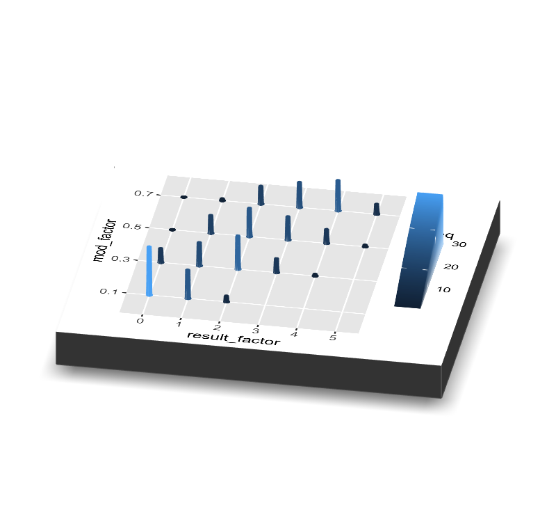
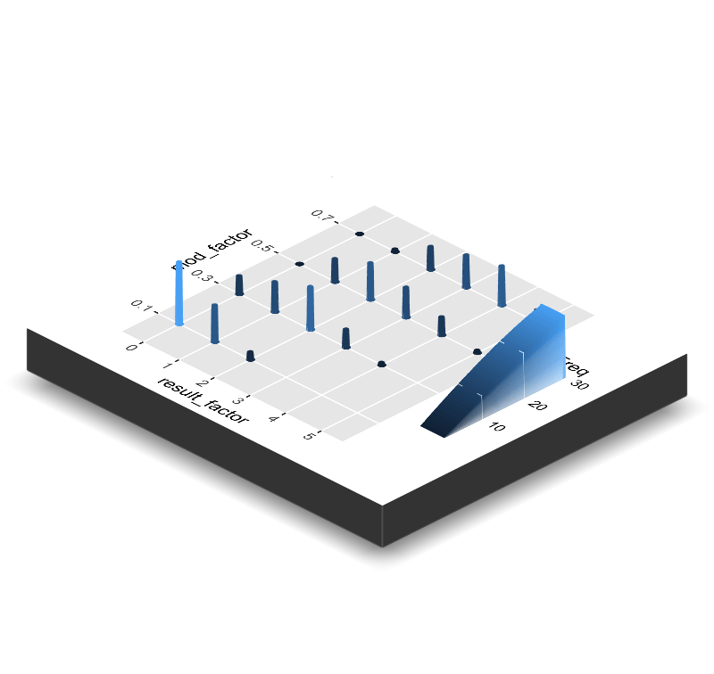
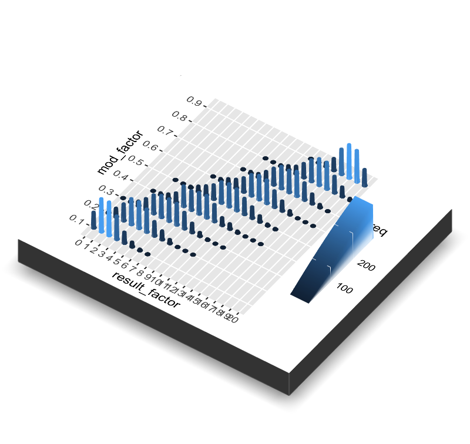
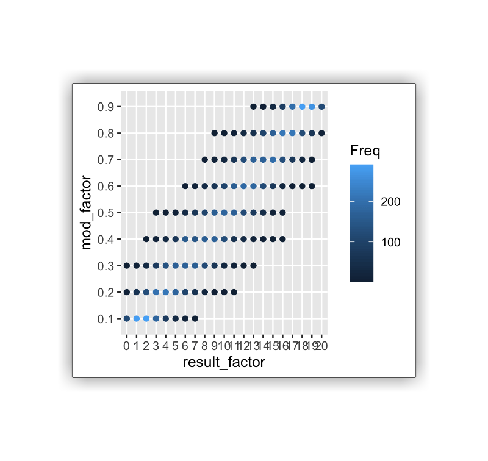
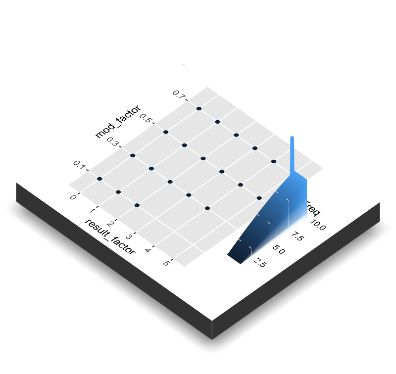
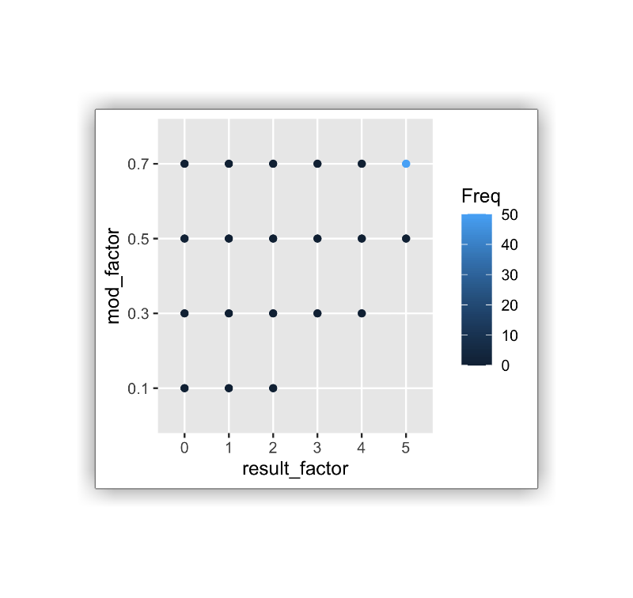
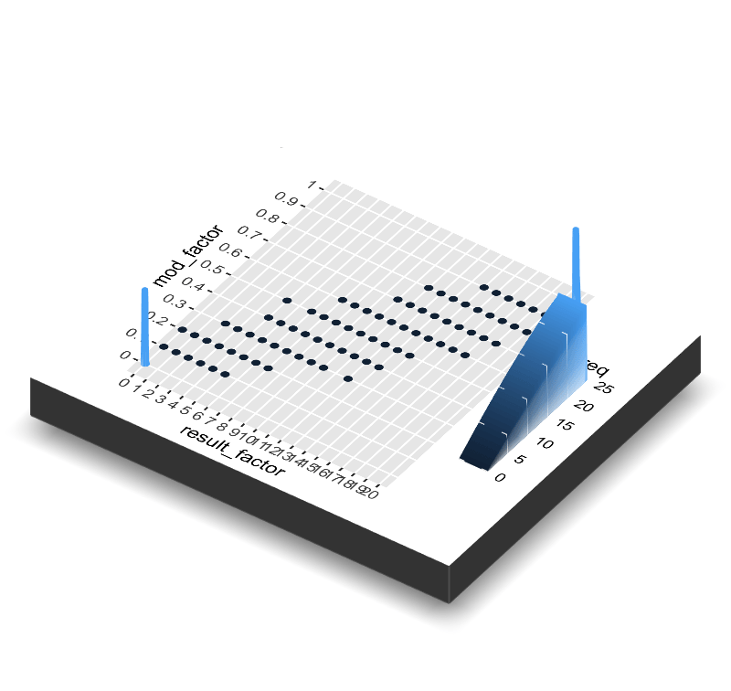
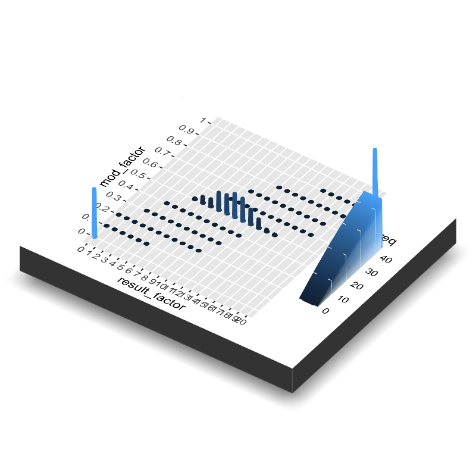

```{r setup, include=FALSE}
knitr::opts_chunk$set(echo = TRUE)
library(tidyverse)
# to load rayshader you need to have xQuartz downloaded on mac see https://www.xquartz.org/ and https://github.com/tylermorganwall/rayshader/issues/5 etc. 
library(rayshader)
library(animation)
library(gifski)
library(magick)
```

```{r}

# edits for joint distribution gif

mydata <- tibble(die.1 = sample(1:6, size = 1000, prob =
                                  c(0.1,0.1,0.1,0.1,0.1,0.5), replace = TRUE),
                 die.2 = sample(1:6, size = 1000, prob =
                                  c(0.1,0.1,0.1,0.1,0.5,0.1), replace = TRUE)) %>%
  group_by(die.1, die.2) %>%
  summarize(total = n())

die1_factor <- as.factor(mydata$die.1)
die2_factor <- as.factor(mydata$die.2)

mtplot = ggplot(mydata) +
 geom_point(aes(x=die1_factor,y=die2_factor,color=total)) +
 scale_color_continuous(limits=c(0,100)) +
 labs(x = "Dice 1", y = "Dice 2")

plot_gg(mtplot, width = 3.5, multicore = F, windowsize = c(800, 800), 
        zoom = 0.85, phi = 30, theta = 10, sunangle = 225, soliddepth = -100,
        reduce_size = TRUE, raytrace = FALSE) +
  labs(x = "Dice 1", y = "Dice 2")

ggsave("joint.png", path = "./05-probability/images")

render_snapshot("./05-probability/images/joint_distribution", clear = TRUE)

plot_gg(mtplot, width = 3.5, multicore = F, windowsize = c(800, 800), 
        zoom = 0.85, phi = 30, theta = 45, sunangle = 225, soliddepth = -100,
        reduce_size = TRUE, raytrace = FALSE)

render_snapshot("./05-probability/images/rayshader2", clear = TRUE)

n_frames <- 2

# create a list of all of the image frames file paths that you want in the gif

img_frames <- paste0("./05-probability/images/rayshader", seq_len(n_frames), ".png")

# create the gif using the magick package to read all of the image frames and
# put save them as a gif in the specified location set by the path

image_write_gif(magick::image_read(img_frames), 
                        path = "./05-probability/animations/joint_distribution.gif", 
                        delay = 6/n_frames)

```

```{r mini_example, echo = FALSE}

set.seed(101)

# generate some data

n_frames <- 10
mod <- seq(.1, .7, 0.2)
rep <- 1:50
tosses <- 5

x <- crossing(mod, rep) %>% 
  mutate(result = rbinom(n = nrow(.), size = tosses, prob = mod))

##  Create cuts:

result_factor <- as.factor(x$result)
mod_factor <- as.factor(x$mod)

z_factor <- table(result_factor, mod_factor)

# assign NA values to all groups with 0 

z_factor[z_factor == "0"] <- NA

# assign NA values to all groups with 1000 because skews plot too much 

z_factor[z_factor == "1000"] <- NA


# convert this table to a dataframe 

data <- as.data.frame(z_factor) %>%
  filter(!(is.na(Freq)))


# initial plot

data_plot <- data %>%
  ggplot(aes(x = result_factor, y = mod_factor)) +
  geom_point(aes(color = Freq))

```

#Basic Example

```{r mini_example_3d_plot, echo = FALSE}

# make sure rgl device is cleared/you have a blank space

# rgl.clear()

# create a basic 3D plot

plot_gg(data_plot, width = 3.5, multicore = F, windowsize = c(800, 800), 
        zoom = 0.85, phi = 30, theta = 45, sunangle = 225, soliddepth = -100,
        reduce_size = TRUE, raytrace = FALSE)

# render the snapshot to save as a png file named "mini_example_1"

render_snapshot("./ray_images/mini/mini_example_1", clear = TRUE)
```


## Change Angle With phi and theta arguments

```{r mini_example_2_plot, echo = FALSE}

plot_gg(data_plot, width = 3.5, multicore = F, windowsize = c(800, 800), 
        zoom = 0.85, phi = 30, theta = 10, sunangle = 225, soliddepth = -100,
        reduce_size = TRUE, raytrace = FALSE)

render_snapshot("./ray_images/mini/mini_example_2", clear = TRUE)

```



# Make a Gif Switching Between the First Two Pngs

Here, I used the magick package because it is easier to use when pulling pngs together into a gif. This takes all of the pngs in the specified location with names specified by the "pattern" (* is a placeholder and takes anything before that with the ending of whatever is after the *) and combines them into a gif, saving it in the location specified in image_write. 


```{r create_mini_gif, echo = FALSE, message = FALSE, warning = FALSE}

n_frames <- 2

# create a list of all of the image frames file paths that you want in the gif

img_frames <- paste0("./ray_images/mini/mini_example_", seq_len(n_frames), ".png")

# create the gif using the magick package to read all of the image frames and
# put save them as a gif in the specified location set by the path

image_write_gif(magick::image_read(img_frames), 
                        path = "./ray_gifs/mini.gif", 
                        delay = 6/n_frames)

```





```{r full_example, echo = FALSE}

# generate full set of data such as in the example

mod <- seq(.1, .9, 0.1)
rep <- 1:1000
tosses <- 20

x <- crossing(mod, rep) %>% 
  mutate(result = rbinom(n = nrow(.), size = tosses, prob = mod))

##  Create cuts:

result_factor <- as.factor(x$result)
mod_factor <- as.factor(x$mod)

z_factor <- table(result_factor, mod_factor)

# assign NA values to all groups with 0 

z_factor[z_factor == "0"] <- NA

# assign NA values to all groups with 1000 because skews plot too much 

z_factor[z_factor == "1000"] <- NA

# convert to data frame

full_data <- as.data.frame(z_factor) %>%
  filter(!(is.na(Freq)))


# basic ggplot of points

full_data_plot <- full_data %>%
  ggplot(aes(x = result_factor, y = mod_factor, color = Freq)) +
  geom_point()

```


```{r plot_3D_static_full_sample, echo = FALSE}

# create basic 3D plot of full sample

plot_gg(full_data_plot, width = 3.5, multicore = F, windowsize = c(800, 800), 
        zoom = 0.85, phi = 45, theta = 35, sunangle = 225, soliddepth = -100,
        reduce_size = TRUE, raytrace = FALSE)
render_snapshot("full_sample_still")

```


# Full Sample Still


Is there a way to embedd the rgl device so this can be interactive like the pop up that comes up when you run the code? Could be cool...



```{r echo = FALSE, include = FALSE}

# for this to not make your R session abort, don't quit out of the RGL device
# pop up until the code stops running! It will take a minute two (or more...)

# initialize number of frames and angle

n_frames <- 10
angle = 90

# create a sequence of names for the image frames 

img_frames <- paste0("front_side_", seq_len(n_frames), ".png")

# save the path of the export folder. "." is a placeholder for the current location

export_folder <- "./ray_images/front_to_side"

# loop 10 times to create 10 pngs with angle phi equal to the current value of angle

for (i in 1:10) {
  
  # create the plot
  
  plot_gg(full_data_plot, width = 3.5, multicore = F, windowsize = c(800, 800), 
        zoom = 0.85, phi = angle, theta = 0, sunangle = 225, soliddepth = -100,
        reduce_size = TRUE, raytrace = FALSE)
  
  # save the snapshot/png to the folder
  
  render_snapshot(file.path(export_folder, img_frames[i]))
  
  # rgl.close ends the current graphic and gets ready to start a new one
  
  rgl::rgl.close()
  
  # decrease the angle for the next plot/iteration
  
  angle = angle - 10
}

```

## front_to_side.gif

```{r front_to_side_gif, include = FALSE, warning = FALSE, message = FALSE}

# create gif!

# making a gif with the magick package... takes all the pngs from the file,
# reads them, joins them, and creates gif to save in specified file location

img_frames <- paste0("./ray_images/front_to_side/front_side_", seq_len(n_frames), ".png")

image_write_gif(magick::image_read(img_frames), 
                        path = "./ray_gifs/front_to_side.gif", 
                        delay = 6/n_frames)
```




# grow.gif

```{r grow_all, include = FALSE}

# create a tibble with time and frequency set to zero to "grow" data

timed_data <- tibble(
  result_factor = data$result_factor,
  mod_factor = data$mod_factor,
  Freq = 0,
  time = 0
)

# create a final_data tibble which will store the data at all time points

final_data <- timed_data

# loop 10 times to create 10 time points

for (i in 1:10) {
  
  # at each time point, loop through the rows
  
  for (row in 1:nrow(data)) {
    
    # if the Freq value of the row is less than what it should be in the end, add one
    
      if (timed_data$Freq[row] < data$Freq[row])
        timed_data$Freq[row] = timed_data$Freq[row] + 1
  }
  
  # save the time as time i 
  
  timed_data$time <- i
  
  # add this dataset for time i to the end of the cumulative final dataset
  
  final_data <- rbind(final_data, timed_data)
}

# timed_data
# final_data
 
```

```{r generate_grow_frames, echo = FALSE}

# initialize number of frames, image frame names, and export folder path

n_frames <- 9
img_frames <- paste0("grow_", seq_len(n_frames), ".png")
export_folder <- "./ray_images/grow"


# set the frequency value to 10 for the outer values so that the z-scale doesn't
# change with each frame

final_data$Freq[final_data$mod_factor == .7 & final_data$result_factor == 5] <- 10

# create 9 plots, one for each time point

for (i in 1:9) {

  # create plot for data in time i
  
  plot_data = final_data %>%
    filter(time == i ) %>%
    ggplot(aes(x = result_factor, y = mod_factor, color = Freq)) +
    geom_point()
  
  # make the plot 3D
  
  plot_gg(plot_data, width = 3.5, multicore = F, windowsize = c(800, 800), 
        zoom = 0.85, phi = 45, theta = 45, sunangle = 225, soliddepth = -100,
        reduce_size = TRUE, raytrace = FALSE, scale = 200)
  
  # save the 3D plot
  
  render_snapshot(file.path(export_folder, img_frames[i]))
  
  # rgl.close ends the current graphic and gets ready to start a new one
  
  rgl::rgl.close()
}

```

```{r echo = FALSE, include = FALSE, warning = FALSE, message = FALSE}

# for some reason the code was breaking if I didn't respecify nframes here but
# couldn't figure out why

n_frames <- 9

# create gif!

img_frames <- paste0("./ray_images/grow/grow_", seq_len(n_frames), ".png")

image_write_gif(magick::image_read(img_frames), 
                        path = "./ray_gifs/grow.gif", 
                        delay = 6/n_frames)
```



# Grow One Distribution Randomly


```{r create_data_for_point_5_gif_with_times, include = FALSE}


# create a data frame where freq is 0 and time is initialized to 1

timed_data <- tibble(
  result_factor = data$result_factor,
  mod_factor = data$mod_factor,
  Freq = 0,
  time = 1
)

# create a final data frame with the initial frame at time 1 being timed_data

final_data <- timed_data


# set the frequency value to 10 for the outer values so that the z-scale doesn't
# change with each frame

final_data$Freq[final_data$mod_factor == .7 & final_data$result_factor == 5] <- 10

# count number of observations for mod_factor == 0.5

point_five_data_total <- data %>%
  filter(mod_factor == "0.5") %>%
  select(Freq) %>%
  summarise(sum(Freq))

# initialize count

count = 0

# while there are still points yet to plot...

while (count < point_five_data_total) {
  
  # select a random row from the rows corresponding to mod_factor == .5
  
  row = sample(9:14, 1)

  # if the current frequency of that row is less than the what the final total should be
  
  if (timed_data$Freq[row] < data$Freq[row]) {
    
    # add one to the frequency count
    
    timed_data$Freq[row] = timed_data$Freq[row] + 1
    
    # increment the count and time
    
    count = count + 1
    timed_data$time = count
    
    # add the data for this time point to the final data set
    
    final_data <- rbind(final_data, timed_data)
  }
}

```


```{r create_images_for_point_5_gif, include = FALSE}

# initialize number of frames, image frame names, and export folder path

n_frames <- pull(point_five_data_total)
img_frames <- paste0("grow_point_5_", seq_len(n_frames), ".png")
export_folder <- "./ray_images/grow_point_5"


# set all columns on top right corner to max height

final_data$Freq[final_data$mod_factor == .7 & final_data$result_factor == 5] <- 50

# initial plot

plot_data = final_data %>%
    filter(time == 1) %>%
    ggplot(aes(x = result_factor, y = mod_factor, color = Freq)) +
    geom_point()

# initialize phi and theta angles

angle_phi = 90
angle_theta = 0


# for the first 1-5 images

for (i in 1:5){
  
  # plot the first frame/initial plot in 3D given angles angle_phi and angle_theta
  
  plot_gg(plot_data, width = 3.5, multicore = F, windowsize = c(800, 800), 
        zoom = 0.85, phi = angle_phi, theta = angle_theta, sunangle = 225, soliddepth = -100,
        reduce_size = TRUE, raytrace = FALSE, scale = 200)
  
  # save image
  
  render_snapshot(file.path(export_folder, img_frames[i]))
  
  # rgl.close ends the current graphic and gets ready to start a newone
  
  rgl::rgl.close()
  
  # change angles for next frame
  
  angle_phi = angle_phi - 50/5
  angle_theta = angle_theta + 35/5
}


# Now, create pngs that show the distribution randomly growing

# we have time = i-5 because we started the sequence at 6 so that the images
# would be named starting at grow_point_5_6 since we have already created 1-5

for (i in seq(6, n_frames + 5)) {
  time_i = i - 5
  
  # plot the data t time_i
  
  plot_data = final_data %>%
    filter(time == time_i) %>%
    ggplot(aes(x = result_factor, y = mod_factor, color = Freq)) +
    geom_point()
  
  # make the plot 3D and save
  
  plot_gg(plot_data, width = 3.5, multicore = F, windowsize = c(800, 800), 
        zoom = 0.85, phi = 40, theta = 35, sunangle = 225, soliddepth = -100,
        reduce_size = TRUE, raytrace = FALSE, scale = 200)
  
  # save image 
  
  render_snapshot(file.path(export_folder, img_frames[i]))
  
  # rgl.close ends the current graphic and gets ready to start a newone
  
  rgl::rgl.close()
}


```

```{r create_grow_point_5_gif, echo = FALSE, warning = FALSE, message = FALSE}

# create gif!

img_frames <- paste0("./ray_images/grow_point_5/grow_point_5_", seq_len(n_frames), ".png")

image_write_gif(magick::image_read(img_frames), 
                        path = "./ray_gifs/grow_point_5.gif", 
                        delay = 6/n_frames)
```




```{r create_base_data_frame_for_full_growth_5, include = FALSE}

# create full dataset with 100 reps

mod <- seq(0, 1, 0.1)
rep <- 1:100
tosses <- 20

x <- crossing(mod, rep) %>% 
  mutate(result = rbinom(n = nrow(.), size = tosses, prob = mod))

##  Create cuts:

result_factor <- as.factor(x$result)
mod_factor <- as.factor(x$mod)

z_factor <- table(result_factor, mod_factor)

# assign NA values to all groups with 0 

z_factor[z_factor == "0"] <- NA

# convert to data frame

full_data <- as.data.frame(z_factor) %>%
  filter(!(is.na(Freq)))


# basic ggplot of points

full_data_plot <- full_data %>%
  ggplot(aes(x = result_factor, y = mod_factor, color = Freq)) +
  geom_point()

```

```{r create_data_frame_for_full_growth_5_with_times, include = FALSE}

# create a data frame where freq is 0 and time is initialized to 1

timed_data <- tibble(
  result_factor = full_data$result_factor,
  mod_factor = full_data$mod_factor,
  Freq = 0,
  time = 0
)


# initialize final dataset to store all data with the initial timed_data set

final_data <- timed_data

# create initial plot

point_five_data_total <- full_data %>%
  filter(mod_factor == "0.5") %>%
  select(Freq) %>%
  summarise(sum(Freq))


# initialize count

count = 0

# while there are still "points" to graph...

while (count < point_five_data_total) {
  
  # sample a row from the possible rows in the table that could correspond to
  # mod .5. This is pretty inefficient - feel free to make it better!
  
  row = sample(6:101, 1)
  #print(paste("count: ", count, "row", row))
  
  # if the row is NA for mod, then print NA
  
  if (is.na(timed_data$mod_factor[row])) {
    print("NA")
  }
  
  # if the mod is .5...
  
  else if (timed_data$mod_factor[row] == "0.5") {
    
    # if there are still observations that need to be plotted...
    
    if (timed_data$Freq[row] < full_data$Freq[row]) {
    
    # add one to the frequency for the row, increment count and time, and add
    # data to the final table
      
    timed_data$Freq[row] = timed_data$Freq[row] + 1
    count = count + 1
    timed_data$time = count
    final_data <- rbind(final_data, timed_data)
    } 
  }
}


# make the 0 and 1 frequencies equal to 25 instead of 100 to keep scale
# reasonable for all the distributions

final_data$Freq[final_data$mod_factor == 1 | final_data$mod_factor == 0] <- 25


```

```{r generate_frames_for_full_growth_point_five, echo = FALSE, eval = FALSE}

# set eval = TRUE to generate the pngs! It can take like 5-10min for all 100

# initialize number of frames needed, img_frames names, and export fold

n_frames <- pull(point_five_data_total)
img_frames <- paste0("full_grow_point_5_", seq_len(n_frames), ".png")
export_folder <- "./ray_images/full_grow_point_5"


# for each of the 100 repetitions...

for (i in seq(1, 100)) {
  
  # create a ggplot of the cumulative data at that repetition
  
  plot_data <- final_data %>%
    filter(time == i - 1) %>%
    ggplot(aes(x = result_factor, y = mod_factor, color = Freq)) +
    geom_point()
  
  # plot in 3D
  
  plot_gg(plot_data, width = 3.5, multicore = F, windowsize = c(800, 800), 
        zoom = 0.85, phi = 40, theta = 35, sunangle = 225, soliddepth = -100,
        reduce_size = TRUE, raytrace = FALSE, scale = 200)
  
  # save the png in the folder according to the image frame number
  
  render_snapshot(file.path(export_folder, img_frames[i]))
  
  # rgl.close ends the current graphic and gets ready to start a newone
  
  rgl::rgl.close()
}


```


```{r create full_grow_gif, echo = FALSE, warning = FALSE, message = FALSE}

# create gif!

img_frames <- paste0("./ray_images/full_grow_point_5/full_grow_point_5_", seq_len(pull(point_five_data_total)), ".png")

image_write_gif(magick::image_read(img_frames), 
                        path = "./ray_gifs/full_grow_point_5.gif", 
                        delay = .05)
```



```{r data_generation_gradual_fill_out, include = FALSE,echo = FALSE, warning = FALSE, message = FALSE}

# take the final frame from the last gif with the built up mod = .5 hist.

last_frame <- final_data %>%
  filter(time == 100)

# set the end scale to 45 because we are looking at the entire distribution
# across the models now and don't want to zoom in too much. Original values are
# 100

last_frame$Freq[last_frame$mod_factor == "1" | last_frame$mod_factor == "0"] <- 45
full_data$Freq[full_data$mod_factor == "1" | full_data$mod_factor == "0"] <- 45

# set the final frame to time = 1 since it will now be our first frame

last_frame$time <- 1

# make a copy of the last frame to save as current frame

current_frame <- last_frame

# save a list of the mod factors to loop through

mod_factors <- c("0", "0.1", "0.2", "0.3", "0.4", "0.5", "0.6","0.7","0.8","0.9","1")

# create a new complete dataset with the first rows corresponding to the last frame

complete_data <- last_frame

# for each mod_factor

for (i in 1:length(mod_factors)) {
  
  #print(i)
  # loop through the rows
  
  for (row in 1:nrow(last_frame)){
    
    # if the row for the current frame is of the current mod_factor
    
    if (current_frame$mod_factor[row] == mod_factors[i]){
      
      # assign that rows frequency to be the full frequency
      
      current_frame$Freq[row] = full_data$Freq[row]
      
      # assign its time to be time + 1
      
      current_frame$time[row] = i + 1
    }
    current_frame$time[row] = i + 1
  }
  
  # add the current frame with the incremented time to the overall data
  
  complete_data <- rbind(complete_data, current_frame)
}
  


```

```{r echo = FALSE, warning = FALSE, message = FALSE}

# initialize number of frames, image names, and export folder

n_frames <- length(unique(complete_data$time))
img_frames <- paste0("gradual_build_", seq_len(n_frames), ".png")
export_folder <- "./ray_images/gradual_build"

# initialize image count

total_count = 1

# for each frame

for (i in seq(1, n_frames)) {
  
  # if i is not 7 (we don't want to plot 7 because it corresponds to mod = .5
  # which is already plotted)...
  
  if (i != 7){
    
    # plot data for time i
    
    plot_data <- complete_data %>%
      filter(time == i) %>%
      ggplot(aes(x = result_factor, y = mod_factor, color = Freq)) +
      geom_point()
    
    # plot in 3D and save according to image count
    
    plot_gg(plot_data, width = 3.5, multicore = F, windowsize = c(800, 800), 
      zoom = 0.85, phi = 40, theta = 35, sunangle = 225, soliddepth = -100,
      reduce_size = TRUE, raytrace = FALSE, scale = 200)
    render_snapshot(file.path(export_folder, img_frames[total_count]))
    
    # rgl.close ends the current graphic and gets ready to start a newone
    
    rgl::rgl.close() 
    
    # increment total count so that the the image frame #s are consecutive and
    # don't skip 7 or else this makes up the gif making later
    
    total_count = total_count + 1
  }
}

```

```{r create gradual_build_gif, echo = FALSE, warning = FALSE, message = FALSE}

# create gif!

img_frames <- paste0("./ray_images/gradual_build/gradual_build_", seq_len(n_frames), ".png")

image_write_gif(magick::image_read(img_frames), 
                        path = "./ray_gifs/gradual_build.gif", 
                        delay = .5)
```


