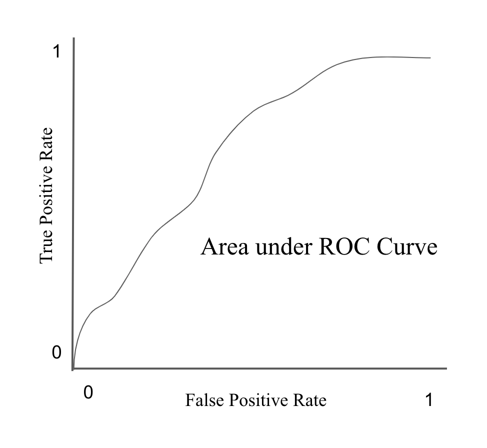

---
output_yaml:
  - _output.yml
---

<!-- Outline: -->

<!-- 1) Preamble: Intro paragraph to classification in general, both 0/1 and multiple categories. Discuss different approaches, all for solving the same problem. -->

<!-- 2) EDA of cces (meaning just the columns we care about). Start with the usual EDA of the subset of cces data which we are using (only 2018 for now), which will be state, age, gender, race, education.   -->

<!-- 3) Logistic Regression. Go through all our themes. -->

<!-- 4) CART -->

<!-- 5) Random Forest -->

<!-- 6) Comparing the models. Advice. -->

<!-- Other stuff: -->

<!-- * tidymodels always. stan_glm from the start. Cover the highlights on Gelman. Divide by 4. predictions are all matter. don't bother with posterior_linpred().  -->

<!-- * Then CART using tidymodels on exactly this data and this problem. Maybe we go slowly, showing how CART works with one variable (numeric and categorical) first. Or maybe we just go straight to the full model.  -->

<!-- * Then random forests using tidymodels on exactly this data and this problem. -->

<!-- * Do we have time to explore Gelman's magic trick: Showing the values of key coefficients when the model is refit to each year separately? That is, how much is age associated with being conservative over time? I hope so! But maybe not. -->

<!-- * Do we have time to do a model which predicts a category with more than 0/1 possible values? I am not sure. If we were going to, we would want to pick something that is not an ordered category, I think. In this data, only race would meet that criteria. Let's revisit this later. -->


# Discrete Response {#discrete-response}

**Binary responses** take on only two values: success ($Y=1$) or failure ($Y=0$), yes ($Y=1$) or no ($Y=0$), et cetera. Binary responses are one of the most common types of data that statisticians encounter.  We are often interested in modeling the probability of success, $p$, based on a set of covariates. As with regression, there are two broad categories of problems: *modeling for prediction* and *modeling for causation*. Although terminology varies across fields, "regression" is generally used for situations in which our *dependent variable* is continuous, as in Chapter \@ref(continuous-response). "Classification" applies to cases in which the dependent variable takes on discrete values, the simplest of which is the binary case.

In this chapter, we will look at three common techniques of **classification** of binary data.  First, we will consider logistic regression, which is similar conceptually to the linear regression models we considered in Chapters \@ref(pitfalls) and \@ref(continuous-response).  Second, we will consider classification and regression trees (CART).  Third, we will discuss random forests. We use the **tidymodels** tools for all examples. At the end, we will compare the performances of all three models.

Which of these models will be the most accurate? Keep this question in mind as you read through this chapter. 

## Exploratory Data Analysis (EDA)

Begin with our usual libraries:

```{r, message=FALSE}
library(tidyverse)
library(broom)
library(skimr)
library(PPBDS.data)
library(tidymodels)
```

Before we start modeling, let's perform some exploratory analysis on the dataset we'll be working with, cces. Cces stands for the Cooperative Congressional Election Study, a study regarding the approval rating of individual voters to their sitting president. Each row captures one voter, some of their demographic information, and how highly they approve (or disaprprove) of the president. Let's first look at the raw data values by either looking at `cces` using RStudio's spreadsheet viewer or by using the `glimpse()` function from the **dplyr** package:

```{r}
glimpse(cces)
```

We will tweak the data by only looking at observations recorded in the year 2018 so that all the responses are about the same president. We'll also select the variables that are currently of interest to us. Finally, because this chapter will be dealing with logistic regressions, we want to convert the numeric `approval` variable into a binary variable. `approval` is a numeric variable from 1-5 with 5 representing the highest approval of the president. In order to do this, we have to turn approval into a binary variable. 1-2 will be coded to 0 to signify disapproval and 3-5 will be coded to 1 for approval. We will also cast `approval` as a factor variable rather than a number, which is useful information for models.

```{r}
ch12 <- cces %>%
  filter(year == 2018) %>%
  select(state, age, gender, race, education, ideology, approval) %>%
  mutate(approval = as.factor(case_when(
    approval == 1 ~ 0,
    approval == 2 ~ 0,
    approval == 3 ~ 1,
    approval == 4 ~ 1,
    approval == 5 ~ 1)))
```

From this, we can gather that there are 16 variables. Notably, there are 60,000 observations even after filtering only for the year 2018. 

Let's also display a random sample of 5 rows of the 60,000 rows. 

```{r}
ch12 %>%
  sample_n(5)
```

Now, let’s compute summary statistics. Let’s use the `skim()` function from the `skimr` package.

```{r}
ch12 %>% 
  skim()
```

You'll notice that we are missing data for our ideology and approval variables. The `complete_rate` column tells us that approval has 3% missing observations and ideology has 0.7% missing observations. Let's use the function `drop_na()` to get rid of these missing observations so they don't interfere with our models later in the chapter:

```{r}
ch12 <- cces %>%
  filter(year == 2018) %>%
  select(state, age, gender, race, education, ideology, approval) %>%
  mutate(approval = as.factor(case_when(
    approval == 1 ~ 0,
    approval == 2 ~ 0,
    approval == 3 ~ 1,
    approval == 4 ~ 1,
    approval == 5 ~ 1))) %>% 
  drop_na()
```

To complete our exploratory data analysis, let's create some data visualizations. 

The primary response variable left in our dataset is `approval`, a (newly) binary variable with 0 representing disapproval of the President and 1 representing approval. So, let's start by looking at the overall distribution of `approval`.

```{r}
ch12 %>%
  ggplot(aes(x = approval)) +
    geom_bar() + 
    labs(y = "Count",
         x = "Presidential Approval",
         title = "Presidential Approval in 2018") 
```

According to this graph, there are roughly 10,000 more voters who disapprove of Trump. To make things more interesting, let's look at `approval` across gender and then race.

```{r}
ch12 %>%
  ggplot(aes(x = approval, fill = gender)) +
  geom_bar() + 
  labs(y = "Count",
       x = "Presidential Approval",
       title = "Presidential Approval in 2018 by Gender") +
  facet_wrap(~ gender) + 
  theme(legend.position = "none")
```

It seems that females have higher rates of disapproval of the President than males have.

```{r}
ch12 %>%
  ggplot(aes(fill = approval, x = race, y = age)) +
  geom_bar(position="fill", stat="identity") + 
  labs(y = "Percentage",
       x = "Presidential Approval",
       title = "Presidential Approval in 2018 by Race")
```

This segmented bar graph shows us the percentage of each race that approved of the president.We can see that the disapproving majority in the overall data is present across most races.

Now, let's use our state variable. Let's create a scatterplot with `approval` to see how the rate of approval varied across states.

```{r, message = FALSE}
ch12 %>%
  mutate(approval = as.integer(approval)) %>%
  mutate(approval = case_when(
    approval == 1 ~ 0,
    approval == 2 ~ 1)) %>%
  group_by(state) %>%
  summarise(avg_approval = sum(approval)/n()) %>%
  ggplot(aes(x = avg_approval, y = reorder(state, avg_approval))) + 
  geom_point() + 
  labs(y = "State",
       x = "Approval Rate of President",
       title = "Presidential Approval by State")
```

## The Question

Now that we've seen some EDA for the general dataset, let's narrow our focus. When creating models, it is important to have a specific question in mind that you can use your model to answer. For our chapter, that question will be "How do Blacks and Hispanic voters vary in their support of the President?" At the end of this chapter, we'll use the three models we created to address answer this. Before then, however, we'll do some exploratory data analysis on this part of the data. 

First, we'll filter `race` to two groups: Black or Hispanic. We'll also code approval to be an integer, which will help when doing the math for our graphs.

```{r}
ch12 <- ch12 %>% 
  filter(race == "Black" | race == "Hispanic") %>%
  mutate(approval = as.integer(approval)) %>%
  mutate(approval = case_when(
    approval == 1 ~ 0,
    approval == 2 ~ 1))
```

Now, let's look at a basic comparison of their rates of approval. 

```{r}
ch12 %>%
  ggplot(aes(x = approval, fill = race)) +
  geom_bar() + 
  labs(y = "Count",
       x = "Presidential Approval",
       title = "Presidential Approval in 2018 for Black and Hispanic voters") +
  facet_wrap(~ race)
```

We can get two important pieces of information from this graph. The first observation is that, although it seems there are a few more black voters, these populations are very similar in size. The second is there is slightly stronger disapproval of the President among Black voters. 

However, we must do further analyses to better understand Black and Hispanic voters. Looking at how different covariates affect approval rate within the group is a great next step. Let's start with age:

```{r, message = FALSE}
ch12 %>%
  group_by(age, race) %>%
  summarise(approval_rate = sum(approval)/n()) %>%
  ggplot(aes(x = age, y = approval_rate, group = race, color = race)) +
  geom_point() +
  geom_line() + 
  labs(x = "Age",
       y = "Approval Rate",
       title = "Presidential Approval Rate by Age")
```

You can see that the difference in the approval ratings increases with age. Older Hispanic voters approve more strongly of the President while older Black voters approve of the President at even lower rates than younger Black voters. This graph shows us why covariates are important. Even adding just one -- age -- added a new complexity to our understanding of question at hand. 

Now, let's add another variable by throwing gender in the mix.

```{r, message = FALSE}
ch12 %>%
  group_by(age, race, gender) %>%
  summarise(approval_rate = sum(approval)/n()) %>%
  ggplot(aes(x = age, y = approval_rate, group = race, color = race)) +
  geom_point() +
  geom_line() + 
  facet_wrap(~gender)+
  labs(x = "Age",
       y = "Approval Rate",
       title = "Presidential Approval Rate by Age and Gender")
```

Now that we've faceted by gender, we can see that the trends from the previous graph don't vary much from male to female. 

```{r, echo = FALSE}
ch12 <- cces %>%
  filter(year == 2018) %>%
  select(state, age, gender, race, education, ideology, approval) %>%
  mutate(approval = as.factor(case_when(
    approval == 1 ~ 0,
    approval == 2 ~ 0,
    approval == 3 ~ 1,
    approval == 4 ~ 1,
    approval == 5 ~ 1))) %>% 
  drop_na()
```

### Themes

As stated at the beginning of the chapter, this chapter will look into three different types of models, all modelling presidential approval against several explanatory variables. Before we do so, let's take a moment to discuss our themes of Wisdom, Courage, Temperance, and Justice.

```{r echo=FALSE, fig.margin=TRUE}
knitr::include_graphics("other/images/Wisdom.jpg")
```

*Prudence* addresses the matter of *validity*. Validity is the measure of how well our data captures the concept we are setting out to analyze and the relevance of the estimand for which we are modelling. So, is `approval` a good measure of what we are trying to estimate? The most obvious problem is that the `approval` variable began as a 5-point scale from "Strongly Disapprove" to "Strongly Approve". Converting this to a binary variable of 0 and 1 may not be a valid measure of presidential approval -- think to yourself, would our data be the same if we asked the exact same respondents to respond to a "Yes" or "No" question rather than transforming their data? Finally, does stating your approval or disapproval of the president on a survey capture what we are trying to study? Perhaps so, but in a practical application, it may be true that whether or not an individual donated money to the President's campaign or if they voted for him in 2016 more accurately captures what we are setting out to study. Finally, are our right hand side variables valid? For example, the 5 point scale of `ideology` from "Strongly Liberal" to "Strongly Conservative" seems rather subjective. 

```{r echo=FALSE, fig.margin=TRUE}
knitr::include_graphics("other/images/Justice.jpg")
```

*Justice* deals with the theme of *model structure*. When establishing your model structure, there are a few steps. Firstly, will our model be predictive or causal? This chapter deals with passing our data through three different model types to predict presidential approval. We are not trying to measure the causal effect of any specific treatment variable, so these will be predictive models. Next, we must make a mathematical formula for our models. Because we are doing several different model types, our formula can be abstracted to... 

$$y_i = f(x_{1i}, x_{2i}, ... )$$

$f()$ represents the different models we will pass our data into, $x_i$ represents our data points, and $y_i$ represents `approval`. Finally, we will construct a preceptor table for this dataset. 

Finally, as a part of model structure, let's look at a preceptor table of our data. 

```{r, echo = FALSE}

# Using real sampled ages but making my own tibble

tibble(subject = c("1", "2", "...", "10,052", "...", "120,892", "20,400,100", "...", "200,627,000", "...", "N"),
       approval = c("0", "1", "...", "?", "...", "0", "0",  "...", "?", "...", "1")) %>%
  gt() %>%
  cols_label(subject = md("**ID**"),
             approval = md("**Approval**")) %>%
  tab_style(cell_borders(sides = "right"),
            location = cells_body(columns = vars(subject))) %>%
  cols_align(align = "center", columns = TRUE) %>%
  tab_header("Preceptor Table of Approval") %>%
  fmt_markdown(columns = TRUE)

```

The purpose of a Preceptor Table is to capture all of the data such that if the question marks were filled out, one wouldn't need to construct a model. The rows in this Preceptor Table represent the full population of N American voters that the cces sampled from for this dataset. For this reason, some have recorded data while other do not. If all of the "?"s were filled out, we would not need to make a predictive model for approval because we know everyone's value for approval. 

```{r echo=FALSE, fig.margin=TRUE}
#knitr::include_graphics("other/images/Courage.jpg")
```

Our discussion of *Courage*, or the *data-generating mechanism*, will be brief, as we will discuss our three model types in-depth throughout the chapter. We will begin with a logistical regression using `glm()`, like in previous chapters. Then we will use a regression tree, which creates partitions based on the right hand side variables and has a prediction of `approval` for each partition. Finally, we will use random forests, which are created by generating and averaging many different regression trees. Each of these models will use the binary variable of `approval` as their left hand variable.

```{r echo=FALSE, fig.margin=TRUE}
knitr::include_graphics("other/images/Temperance.jpg")
```

Finally, *Temperance* (or *humility*). Because the world is extremely complex and ever-changing, our models are never as good as they appear. We will hold off on our full discussion of *Temperance* until the end of the chapter when we've completed the models. Until then, keep in mind these questions: Is our model *representative* of the greater world? How accurately does our model predict *unknown unknowns*? What are the flaws in our modelling process?

## Logistic regression

### What is logistic regression?

Now that we know our dataset a little better, let's begin our first way of modelling binary/discrete data: logistic regressions. 

Figure \@ref(fig:OLSlogistic) illustrates a data set with a binary (0 or 1) response ($Y$) and a single continuous predictor ($X$).  The blue line is a linear regression to model the probability of a success ($Y=1$) for a given value of $X$. With a binary response, the linear regression has an obvious problem: it can produce predicted probabilities below 0 and above 1. Probabilities can only range from 0 up to and including 1 as these represent a 0% and 100% chance of an event happening, respectively.

The red curve is the *logistic regression* curve.  Note that its characteristic "S" shape always produces predicted probabilities between 0 and 1.  Here is the formula for a logistic regression:

Where $p$ is the probability of a "yes" or "success" for a given set of predictors $X$.

<!-- Revisit nomenclature after chapter 5 -->

```{r, OLSlogistic, fig.align="center", out.width="60%", fig.cap='Linear vs. logistic regression models for binary response data.', echo=FALSE, warning=FALSE, message=FALSE}

set.seed(0)
dat <- tibble(x=runif(200, -5, 10),
                  p=exp(-2+1*x)/(1+exp(-2+1*x)),
                  y=rbinom(200, 1, p),
                  logit=log(p/(1-p)))

ggplot(dat, aes(x = x)) +
  geom_point(aes(y = y)) +
  geom_smooth(aes(y = y, color = "blue"), method = "lm", se=FALSE) +
  geom_line(aes(y = p, color = "red")) +
  scale_color_manual(name = 'Regression model', 
         values = c('blue', 'red'), 
         labels = c('Linear', 'Logistic'), guide = 'legend') +
  theme_minimal()
```

<!-- DK: How does the math work here? log(p/1-p) seems, to me, to map 0,1 to 0,infinity. -->

The mathematical function $log\left(\frac{p}{1 - p}\right)$ is called the *logit function* and it transforms variables from the space $(0, 1)$ (like probabilities) to $(-\infty, \infty)$.  The inverse of that function, the *standard logistic function*, is $\frac{1}{1 + e^{-x}}$ and transforms variables from the space $(-\infty, \infty)$ to $(0, 1)$.  From that latter function's name we get the terminology of *logistic regression*.

### One categorical explanatory variable

Let's start our modeling by predicting `approval` with a single categorical explanatory variable. We'll start by modeling our binary `approval` with the categorical variable `race`. Like last chapter, we'll  be using tools from the **tidymodels** package. Rather than having to use a different function each time we construct a model (choosing between lm(), glm(), and other modelling function), **tidymodels** streamlines the synthax for any model we want to construct.

```{r, message = FALSE}
library(tidymodels)
```

First, in the **tidymodels** workflow, we have to save the *model specification*.  We do that using two functions: `logistic_reg()` and `set_engine()`.

```{r}
race_mod <- logistic_reg() %>%
  set_engine("glm")
```

`logistic_reg()` says that we want to fit a logistic regression, and `set_engine("glm")` specifies that we want to do it using `glm()`. By unifying the syntax, it means that you don't have to memorize how a lot of different functions work to use different model types, from glm to random forests that we'll use later in the chapter. `glm()` operates very similarly to `lm()`, but will instead model along the red line in Figure \@ref(fig:OLSlogistic) rather than the blue line when using a logistic outcome variable.

Note that our new object, `race_mod`, doesn't contain our data or a formula.  In order actually to fit our model, we need to feed `race_mod` to a function called `fit()`.  `fit()` takes as its first argument the model specification, but otherwise it operates similarly to `lm()` and `glm()`. We have to wrap `approval` in `factor()`, because `fit()` is more careful than `glm()` in requiring that classification models actually have categorical outcomes.

```{r}
race_fit <- fit(race_mod,
                    factor(approval) ~ race,
                    data = ch12)
```

One we have fit the model, how can we use it?  The `glm` object is still stored in `race_fit$fit`, so we can access that and use `tidy()`, just like we did before:

```{r}
race_fit$fit %>%
  tidy(conf.int = TRUE) %>%
  select(term, estimate, conf.low, conf.high) %>%
  gt()
```

The intercept here is the omitted category, Asian.

How can we interpret the coefficients?  Unlike linear regressions, these coefficients aren't directly interpretable.  Recall our logistic regression model equation:

\[
\log\left(\frac{p}{1 - p}\right)=\beta_0+\beta_1X 
\]

A one-unit change in $X$ thus is associated with a one-unit change in $log\left(\frac{p}{1 - p}\right)$, where $p$ is the predicted probability of success. It is hard to understand intuitively what this means. We can directly calculate all the possible values of $p$ this model by using the *standard logistic function*:

\[
p = \frac{1}{1 + e^{-(\beta_0+\beta_1X)}} 
\]

We can first use this formula to fill $b_0$ with the intercept (representing Asians) and omit the $b_1$ as we are solving for the probability of an Asian American approving of the President.


\[
p_{pres\_approve} = \frac{1}{1 + e^{-(-1.06)}} = 0.257
\]

We can then fill in the $b_1$ term to calculate the probabilities of all races:
- White: $\frac{1}{1 + e^{-(-1.06 + 0.99)}} = 0.482$
- Black: $\frac{1}{1 + e^{-(-1.06-1.01)}} = 0.112$
- Hispanic: $\frac{1}{1 + e^{-(-1.06 + 0.036)}} = 0.264$
- Middle Eastern: $\frac{1}{1 + e^{-(-1.06 + 0.007)}} = 0.259$
- Native American: $\frac{1}{1 + e^{-(-1.06 + 1.1)}} = 0.51$
- Mixed: $\frac{1}{1 + e^{-(-1.06 + 0.071)}} = 0.271$
- Other: $\frac{1}{1 + e^{-(-1.06 + 1.3)}} = 0.559$

<!-- We can then interpret the effect of moving from one category to another.  For example, the predicted probability of a White voter approving of the President is 0.225 greater than an Asian voter. Note that we could have obtained this through the *divide by 4 rule*:  $0.482 / 4 \approx 0.16$. -->
<!-- MB: Hold off until numeric variable for divide by 4?-->

However, there is a way to calculate these predicted probabilities using R without doing all of the math of the standard logistic function..

We have previously defined the following three concepts for a linear regression:

1. Observed values $y$, or the observed value of the outcome variable
2. Fitted values $\widehat{y}$, or the value on the regression line for a given $x$ value
3. Residuals $y - \widehat{y}$, or the error between the observed value and the fitted value

We obtained these values and other values using the `augment()` function from the **broom** package. Recall too that we used the `.se.fit` column to construct confidence intervals.  We'll see here how we can apply these same concepts to logistic regression.

<!-- MB: This entire part has to be redone in tidymodels because augment doesn't work anymore

regression_points <- race_fit %>%
  augment() %>%
  mutate(conf.low = .fitted - 2 * .cooksd,
         conf.high = .fitted + 2 * .cooksd) %>%
  select(approval, race, .fitted, conf.low, conf.high, .resid)
regression_points


regression_points <- race_fit %>%
  augment(type.predict = "response") %>%
  mutate(conf.low = .fitted - 2 * .cooksd,
         conf.high = .fitted + 2 * .cooksd) %>%
  select(approval, race, .fitted, conf.low, conf.high, .resid)
regression_points


regression_points <- augment(race_fit,
                             type.predict = "response") %>%
  mutate(conf.low = .fitted - 2 * .cooksd,
         conf.high = .fitted + 2 * .cooksd) %>%
  select(approval, race, .fitted, conf.low, conf.high, .resid)
regression_points %>%
  slice(1:10) %>%
  gt() %>%
  tab_source_note(md("Regression points (First 10 out of 60,000 voters)"))


Now each of the `.fitted` values is a *predicted probability* of a Democratic victory from our model for a particular district and the confidence intervals are confidence intervals around that predicted probability. You'll notice how the fitted value in this table is the same as the probabilities we calculated by hand using the standard logistical function.

You may be wondering how to interpret the residuals.  The residuals reported by `augment()` for a logistic regression are called *deviance residuals*.  A deviance residual can be calculated for each observation using:

\[
\textrm{d}_i = 
\textrm{sign}(Y_i-\hat{p_i})\sqrt{-2 [ Y_i \text{log} \hat{p_i} + (1 - Y_i) \text{log} (1 - \hat{p_i}) ]}
\]

where $Y_i$ is the actual outcome and $p_i$ is the predicted probability from the logistic regression model.

The sum of the individual deviance residuals is referred to as the **deviance** or **residual deviance**. The deviance is used to assess the model. As the name suggests, a model with a small deviance is preferred.

However, you can also have `augment()` report residuals as differences between the observed outcome and the predicted probabilities by using `type.residuals = "deviance"`:


regression_points <- race_fit %>%
  augment(type.predict = "response",
          type.residuals = "deviance") %>%
  mutate(conf.low = .fitted - 2 * .cooksd,
         conf.high = .fitted + 2 * .cooksd) %>%
  select(approval, race, .fitted, conf.low, conf.high, .resid)
regression_points

regression_points <- augment(race_fit,
                             type.predict = "response",
                             type.residuals = "deviance") %>%
  mutate(conf.low = .fitted - 2 * .cooksd,
         conf.high = .fitted + 2 * .cooksd) %>%
  select(approval, race, .fitted, conf.low, conf.high, .resid)
regression_points %>%
  slice(1:10) %>%
  gt() %>%
  tab_source_note(md("Regression points (First 10 out of 60,000 voters)"))


Now, the `.resid` value is the difference between the actual outcome (`approval`) and the predicted probability.

-->

### One numerical explanatory variable

We'll now predict `approval` with a single numerical explanatory variable, `age` using **tidymodels**. We'll begin, once again, by setting our engine to `glm`.


```{r}
age_mod <- logistic_reg() %>%
  set_engine("glm")
```

Now, we'll use `fit` to add our formula to the model. 

```{r}
age_fit <- fit(age_mod,
               factor(approval) ~ age,
               data = ch12)
```

We'll use `tidy()` to view the `glm` object is still stored in `race_fit$fit`.

```{r}
age_fit$fit %>%
  tidy(conf.int = TRUE) %>%
  select(term, estimate, conf.low, conf.high) %>%
  gt()
```

How do we interpret the coefficients in this model?  Since the `age` coefficient is positive, that means that each additional year of age is associated with a higher approval of the President in 2018. 

If we wanted to learn the predicted probabilities for any given value of `age`, we can plug in our values of `age` into the standard logistic function, like so:

\[
p_{dem\_win} = \frac{1}{1 + e^{-(-1.43 + 0.023 \times year)}} 
\]

For example, the predicted probability of a 90-year-old approving of the President is 65.4% while the predicted probability of a 19-year-old approving of the President is 27%.

Note that since this is not a linear function, a one-unit change in `year` will be associated with various one-unit changes in `year`, depending on what `year` you are starting from.  Recall the figure we used to start the chapter:

A one-unit change in $X$ thus is associated with a one-unit change in $log\left(\frac{p}{1 - p}\right)$, where $p$ is the predicted probability of success. It is hard to understand intuitively what this means. We can directly calculate all the possible values of $p$ this model by using the *standard logistic function*:

```{r, echo = FALSE, message = FALSE}
ggplot(dat, aes(x = x)) +
  geom_point(aes(y = y)) +
  geom_smooth(aes(y = y, color = "blue"), method = "lm", se=FALSE) +
  geom_line(aes(y = p, color = "red")) +
  scale_color_manual(name = 'Regression model', 
         values = c('blue', 'red'), 
         labels = c('Linear', 'Logistic'), guide = 'legend') +
  theme_minimal()
```

A linear regression line (in blue) has a constant slope, which means that no matter what $x$ you start with, the effect of going from $x$ to $x + 1$ on $y$ is the same number.  However, take a look at the logistic regression curve (in red).  The value of the slope for very high or very low values of $x$ is smaller (approaching 0 as $x$ tends to negative or positive infinity), while the slope in the middle of the curve is highest.  The steepest part of the curve corresponds to that part of the curve where the predicted probability equals 0.5.  That is, the effect of a one-unit change in $x$ is the highest when the predicted probability for that $x$ is close to 0.5 and smallest when the predicted probability for that $x$ is close to 0 or 1.

You can always use R to calculate the predicted probabilities for any value of $x$ and thus calculate the effect of moving from a particular $x$ to $x + 1$.  But this can get complicated.  In particular, once you start employing logistic regression with multiple predictors, the effect of a one-unit change in a predictor $x$ depends not only on $x$, but on the values of all the other predictors in your model!  You can always plug in all the coefficients and values of your predictors into the logistic function to calculate predicted probabilities, but if you don't do that, how can you interpret the coefficients?

Here is where we can use the *divide by 4 rule* that we discussed before.  A logistic regression coefficient divided by 4 is the effect of that variable at the steepest part of the logistic regression curve, which, as we just saw, corresponds to where the predicted probability is 0.5.

Therefore, you can divide a logistic regression coefficient by 4 to get an upper bound on the effect a one-unit change in that predictor will have on the predicted probability of your outcome.  In this case, the approximation tells us that each additional year of age is associated with about a $0.023 / 4 = 0.005$ increase in the predicted probability of a voter approving of the President.

While `race_model` and `age_model` both tell us something interesting, we could learn more with an *interaction model* that includes multiple predictors.

### Multiple explanatory variables

We'll now predict `approval` with three variables, `race`, `age` and `gender`, as well as the interaction between the `race` and `age`.

This time, we'll do it slightly differently. We'll still be using **tidymodels**, but this time we will split the data into a testing set and training set. The training dataset will be used to create our model and the testing dataset will be used to test our final model’s performance. This is a typical part of the tidymodels workflow; it was omitted in our previous two examples because we were not testing the performance of either models. The `initial_split()` function reserves 25% of the data for testing by default. 

```{r}
log_split <- initial_split(ch12)


log_training <- log_split %>% training()
log_testing <- log_split %>% testing()
```

Then, let's set the *model specification* to be a logistic regression using `glm`.

```{r}
logistic_mod <- logistic_reg() %>%
  set_engine("glm")
```

For our multi-variable logistic regression, we'll be using 3 different explanatory variables, as well as the interaction between 2 of those variables, `race` and `age`. We will begin by defining the formula of our model. In our last two examples, we constructed our formulas directly in `fit()`. This time, we will do it seperately, as the formula will be used seperately later when cross-validating our results.

```{r}
log_formula <- formula(approval ~ age + gender + race + race:age)
```

Finally, let's fit our model. `fit()` will take in our model specification `logistic_mod`, our formula, and our training set of data. We are reserving our testing set for later.

```{r}
logistic_fit <- fit(logistic_mod, log_formula, log_training)

logistic_fit$fit %>%
  tidy(conf.int = TRUE) %>%
  select(term, estimate, conf.low, conf.high) %>%
  gt()

```

This table may at first seem a bit intimidating, but once we understand how to use the coefficients, the model becomes more simple to interpret.

You may notice that the coefficient associated with each race and age has changed significantly from `race_model` and `age_model`. The reason these numbers are significantly different is because our model now incorporates gender, age, and how age changes by gender. An observation's fitted value is now the sum of their race's coefficient, whether or not they are a male, and the age coefficient corresponding to their race. For example, the fitted value of a 21-year-old white man is addition of raceWhite + the genderMale  + 21 * raceWhite:age. The fitted value of an 45-year-old Asian woman is the addition of (Intercept) + 45 * age; this model uses Asian as the default race, which is why we use the (Intercept) and age coefficients.

### K-Fold Cross-Validation

We can check whether the model we created is accurate by using cross-validation. Recall that when we first started constructing this model, we used `initial_split()` to reserves 25% of the data for testing and 75% of the data for creating the model. By doing so, the model avoids the issue of overtraining.

The function `vfold_cv()` splits your training set into `v` smaller sections. We will be using `v = 5` so that the small, individual sections are still large enough to train the model. The first four folds will be used to train the model, and the last fold is always used to assess the accuracy of the model.

```{r}
log_folds <- log_training %>%
  vfold_cv(v = 5)
```

Now, we create the recipe for our cross-validation. A recipe is the same thing as a formula, except it includes the dataset that the formula is enacted upon (`log_training` in our case).

```{r}
log_recipe <- recipe(approval ~ age + gender + race, data = log_training) 
```

You'll notice that our interaction term is missing from this recipe. In order to add interaction terms to a recipe, you must take the additional step of using `step_interact`.

```{r}
log_recipe <- log_recipe %>%
  step_interact(terms = ~ age:race)
```

Finally, we'll use `fit_resamples()` to run our logistic model on the different folds we created in the training set. `fit_resamples()` takes in our model specification, our recipe, and the folds we created. This will give us our `accuracy` and `roc_auc` values. 

```{r, message = FALSE, warning = FALSE}
fit_resamples(logistic_mod,
              log_recipe,
              log_folds) %>%
  collect_metrics()
```
<!-- MB: interpret these values -->

Now that we saw how the training set performed, it's time to use our testing set. We do so by applying `log_testing` to `predict()`.

```{r}
logistic_mod %>%
  fit(log_formula, data = log_training) %>%
  predict(new_data = log_testing)
```

Here, the model created by the training set predicts whether the observations in testing set would approve or disapprove of the President. While this is an interesting set of predictions, it doesn't tell us much about how well our model performed. So, we need to solve for the rmse, or the mean squared error.

To extract the rmse, we set the "truth" to `approval` so this function can compare our predicted values to the true values.

```{r}
logistic_mod %>%
  fit(log_formula, data = log_training) %>%
  predict(new_data = log_testing) %>%
  bind_cols(log_testing) %>%
  rmse(truth = as.numeric(approval), estimate = as.numeric(.pred_class))
```

The mean squared error is about 0.62.

<!-- MB: interpret this value -->

## Classification and regression trees (CART)

```{r, echo=FALSE}
img_path <- "images"
```

### What is CART?

Logistic regression is just one of many methods we can use to model binary responses.  CART is another approach, which we'll learn about in this section.

A **tree** is basically a flow chart of yes or no questions. The general idea of the methods we are describing is to define an algorithm that uses data to create these trees with predictions at the ends, referred to as _nodes_. Decision trees predict an outcome variable $Y$ by *partitioning* the predictors.

**Classification trees**, or decision trees, are used in prediction problems where the outcome is categorical.  When the outcome is numerical, they are called **regression trees**; hence the acronym **CART**, standing for Classification and Regression Trees.  The general idea here is to build a decision tree and, at the end of each _node_, obtain a predictor $\hat{y}$. In this case, $\hat{y}$ would identify the likelihood of a voter in that node approving of the President.  

But how do we decide on which partitions to make  ($R_1, R_2, \ldots, R_J$) and how do we choose $J$, the total number of partitions? Here is where the algorithm gets a bit complicated.

Classification trees create partitions recursively. We start the algorithm with one partition in which every observation is classified as either 0 or 1. But after the first step we will have two partitions. After the second step we will split one of these partitions into two and will have three partitions, then four, then five, and so on.

Now, after we define the new partitions $R_1$ and $R_2$, and we decide to stop the partitioning process, we compute predictors by taking the most common category of all the observations $y$ for which the associated $\mathbf{x}$ is in $R_1$ and $R_2$. We refer to these two as $\hat{y}_{R_1}$ and $\hat{y}_{R_2}$ respectively. 

<!--MB: make this a margin note?
But how do we pick the predictor $j$ and the value $s$? One of the more popular ways for categorical data is the _Gini Index_. In a perfect scenario, the outcomes in each of our partitions are all of the same category since this will permit perfect accuracy. The _Gini Index_ is going to be 0 in this scenario, and become larger the more we deviate from this scenario. To define the Gini Index, we define $\hat{p}_{j,k}$ as the proportion of observations in partition $j$ that are of class $k$. The Gini Index is defined as $\mbox{Gini}(j) = \sum_{k=1}^K \hat{p}_{j,k}(1-\hat{p}_{j,k})$ -->
<!-- If you study the formula carefully you will see that it is in fact 0 in the perfect scenario described above, since $\hat{p}_{j,k}(1-\hat{p}_{j,k}) = 0$ for all $k$. -->

Once we are done partitioning the predictor space into regions, in each region a prediction is made using the observations in that region. 

<!-- But when do we stop partitioning?  Every time we split and define two new partitions, the Gini Index improves. This is because with more partitions, our model has more flexibility to adapt to our data.  However, our model may therefore perform worse when exposed to new data (this problem is called *overfitting*). This connects to our discussion of validity and models, as the conditions used to create the model will be too specific to accurately extrapolate to new data points. To avoid this, the algorithm sets a minimum for how much the Gini Index must improve for another partition to be added. This parameter is referred to as the _complexity parameter_ ($c_p$). The measure of fit must improve by a factor of $c_p$ for the new partition to be added. Large values of $c_p$ will therefore force the algorithm to stop earlier which results in fewer nodes. -->

Classification trees have certain advantages that make them very useful. They are highly interpretable, even more so than linear models. They are easy to visualize (if small enough).  Finally, they can model human decision processes. However, in terms of accuracy, they are rarely the best performing method since they are not very flexible. Random forests, explained in the next section, improve on some of the shortcomings of classification trees.

One limitation of CART is its lack of fitted values. Unlike a `glm()`, you can't clean predicted probabilities or point estimates from CART. Rather, you simply get a prediction of 0 or 1 for whatever observation you pass through the tree.  

### Multivariate CART

Before creating any model, let's split our data into a training and testing set, just like we did with our multivariate logistical regression.

```{r}
cart_split <- initial_split(ch12)

cart_training <- cart_split %>% training()
cart_testing <- cart_split %>% testing()
```

To create a CART using multiple variables, we'll use the `decision_tree()` model specification and the `"rpart"` engine.  The syntax is very similar to when we used `logistic_reg()`.  Note that our binary response variable has to be a factor, just like with `logistic_reg()`. 

```{r}
tree_mod <- decision_tree() %>%
  set_engine("rpart",
             model = TRUE) %>%
  set_mode("classification")
```

Note that we added the argument `model = TRUE` to `set_engine()`.  This saves the model frame, which we will need to avoid a warning when we plot the trees later.

The function `set_mode()` wasn't necessary when we did logistic regression.  Here it clarifies that we want a *classification* tree rather than a *regression* tree.

Next, let's create our formula for this tree. We will use the same formula that we used in the logistical regression.

```{r}
cart_formula <- formula(approval ~ age + gender + race)
```

Now that we have the object `tree_mod` and our formula, we can use `fit()` to construct our tree.

```{r}
cart_fit <- fit(tree_mod,
                 cart_formula,
                 cart_training)
```

As you can see, **tidymodels** has the same workflow for creating a CART as it does for fitting a logistic regression, but with our model specification saved in `tree_mod` rather than the model specification we saved in `logistic_mod`.

What was the result of our tree?

```{r}
cart_fit
```

It's not helpful to look at the results of a tree as text.  In order to visualize the tree, we'll use the `prp()` function in the **rpart.plot** package.  Remember that the model object is stored in `cart_fit$fit`.

```{r, message = FALSE}
library(rpart.plot)

cart_fit$fit %>%
  prp(extra = 6, varlen = 0, faclen = 0)
```

The arguments `varlen = 0` and `faclen = 0` ensure that the full variable names and factor levels are printed.  The argument `extra = 6` shows the proportion of "yes" outcomes within a given partition. Since we'll be using these same arguments throughout the chapter, we'll create a new function that calls `prp()` but with these options as defaults:

```{r}
prp_ch12 <- function(x, ...) prp(x, extra = 6, varlen = 0, faclen = 0, ...)

cart_fit$fit %>%
  prp_ch12()
```

So, how do we interpret this tree? We are given two partitions; the first is for race. The observations that identify as any of the named races are classified as disapproving of the President, denoted by the 0 on that node. All other racial identities proceed to the next partition. If these people are younger than 44, they are also classified as disapproving of the president. Voters 44 and older are classsified as approving of the President. 

The decimal numbers within each box identify how many observations in that node approved of the President. This means that only 20% of observations in the first node approved of the President, 38% in the second node, and 54% in the third node.

You may notice that this tree did not factor in gender. 
<!-- MB: Trees cannot handle interaction terms, -->

### K-Fold Cross-Validation

Once again, we can check whether the model we created is accurate by using cross-validation. 

We'll use `vfold_cv()` to create `v = 5` splits in the training set, using the final fold to asses the model's accuracy.

```{r}
cart_folds <- cart_training %>%
  vfold_cv(v = 5)
```

Then, we'll create our recipe and plug it into `fit_resamples()` along with `tree_mod` and `cart_folds`. We'll use `collect_metrics()` to get our accuracy values.

<!-- MB: Added interaction term here, but not in the tree above -->

```{r, message = FALSE, warning = FALSE}
cart_recipe <- recipe(approval ~ age + race + gender, data = cart_training) 

cart_recipe <- cart_recipe %>%
  step_interact(terms = ~ age:race)

fit_resamples(tree_mod,
              cart_recipe,
              cart_folds) %>%
  collect_metrics()
```
<!-- Interpret accuracy values -->

Now that we saw how the training set performed, we'll use our testing set. We do so by applying `cart_testing` to `predict()`.

```{r}
tree_mod %>%
  fit(cart_formula, data = cart_training) %>%
  predict(new_data = cart_testing)
```

Once again, the model predicts whether the observations in testing set would approve or disapprove of the President based on the model created with the training set. 

To extract the rmse, we set the "truth" to `approval` so this function can compare our predicted values to the true values.

```{r}
tree_mod %>%
  fit(cart_formula, data = cart_training) %>%
  predict(new_data = cart_testing) %>%
  bind_cols(cart_testing) %>%
  rmse(truth = as.numeric(approval), estimate = as.numeric(.pred_class))
```

The mean squared error is about 0.616.


### Predicting New Data

Let's now use our tree to make some predictions. When used on trees, the `predict()` function takes in the tree object and new observations containing the explanatory variables. In this case, we'll be passing in a 54-year-old Asian voter, a 41-year-old Black voter, a 56-year-old White voter, and a 70-year-old Native American voter.

```{r}

newdata <- tibble(race = c("Asian", "Black", "White", "Native American"),
                  age = c(54, 41, 56, 70),
                  gender = c("Male", "Female", "Male", "Female"))

predict(cart_fit, new_data = newdata) 

```

As you can see, the tree predicted that our first two new voters would disapprove of the President while our second two would approve based on their age and race.

```{r}
#library(rstanarm)
#posterior_linpred(cart_fit, newdata)
```

## Random forests

### What are random forests?

Random forests are a very popular machine learning approach that addresses the shortcomings of decision trees using a clever idea. The goal is to improve prediction performance and reduce instability by _averaging_ multiple decision trees (a forest of trees constructed with randomness). It has two features that help accomplish this.

The first step is _bootstrap aggregation_ or _bagging_. The general idea is to generate many predictors, each using classification trees, and then forming a final prediction based on the average prediction of all these trees. To assure that the individual trees are not the same, we use the bootstrap to induce randomness. These two features combined explain the name: the bootstrap makes the individual trees **randomly** different, and the combination of trees is the **forest**. The specific steps are as follows.

1. Build decision trees using a portion of the data called the training set. We refer to the fitted models as $T_1, T_2, \dots, T_B$. We later explain how we ensure they are different.

2. For every observation in the test set, form a prediction $\hat{y}_j$ using tree $T_j$.

3. For categorical data classification, predict $\hat{y}$ with majority vote (most frequent class among $\hat{y}_1, \dots, \hat{y}_T$).
     
So how do we get different decision trees from a single training set? For this, we use randomness in two ways which we explain in the steps below. Let $N$ be the number of observations in the training set. To create $T_j, \, j=1,\ldots,B$ from the training set we do the following:

4. Create a bootstrap training set by sampling $N$ observations from the training set **with replacement**. This is the first way to induce randomness. 
    
5. A large number of features is typical in machine learning challenges. Often, many features can be informative but including them all in the model may result in overfitting. The second way random forests induce randomness is by randomly selecting features to be included in the building of each tree. A different random subset is selected for each tree. This reduces correlation between trees in the forest, thereby improving prediction accuracy. 

### Fitting random forests

<!-- MB: http://www.rebeccabarter.com/blog/2020-03-25_machine_learning/#evaluate-the-model-on-the-test-set
https://s3.amazonaws.com/assets.datacamp.com/production/course_7215/slides/chapter3.pdf
-->

We will demonstrate by fitting a random forest to the House elections data. Before we even write our model formula, we need to split the data to create a *training set* and a *testing set*. The training dataset will be used to create our model and the testing dataset will be used to test our final model’s performance.

```{r}
forest_split <- initial_split(ch12, 
                                prop = 3/4)

forest_train <- training(forest_split)
forest_test <- testing(forest_split)
```

Next, we will use the `rand_forest()` function to create our model specification, setting the engine to `"randomForest"` and the mode to `"classification"`. 

```{r, message = FALSE}
library(randomForest)

forest_mod <- 
  rand_forest() %>%
  set_engine("randomForest") %>%
  set_mode("classification") 

```

We will now create the formula for our forest.

```{r}
forest_formula <- formula(approval ~ age + gender + race + race:age)
```

Finally, let's fit our model. `fit()` will take in our model specification `logistic_mod`, our formula, and our training set of data. We are reserving our testing set for later.

```{r}
forest_fit <- fit(forest_mod, forest_formula, forest_train)
```

If we graph the "OOB estimate of error rate", we can see that this model settles around an error rate of just under 40% (or, looking at it the other way, an accuracy of 60%). We can see how the error rate of our algorithm changes as we add trees by looking at `forest_fit$fit$err.rate[, "OOB"]`.  By default, `randomForest()` (the engine we specified) grows 500 trees. -->

```{r}
tibble(`Error rate` = forest_fit$fit$err.rate[, "OOB"], Trees = 1:500) %>%
  ggplot(aes(x = Trees, y = `Error rate`)) +
  geom_line() + 
  theme_classic()
```

We can see that in this case, the accuracy improves as we add more trees until about 50 trees where accuracy stabilizes. Random forests often perform better than other methods. However, a disadvantage of random forests is that we lose interpretability---we don't get anything like the coefficients from a logistic regression or the single tree from CART. 

### K-Fold Cross-Validation

Just like with CART and logistic regression, we will use cross-validation to check the accuracy of our random forest. Once again, we'll create the recipe and add our interaction term seperately.

```{r}

forest_recipe <- recipe(approval ~ age + gender + race, 
                        data = forest_train)

forest_recipe <- forest_recipe %>%
  step_interact(terms = ~ age:race)

#approval_workflow <- workflow() %>%
  # add the recipe
#  add_recipe(approval_recipe) %>%
  # add the model
#  add_model(forest_mod)

```

We will also create our folds using `vfold_cv()`.

```{r}
forest_folds <- forest_train %>%
  vfold_cv(v = 5)
```

Now we use `fit_resamples()` to see how it accurately  the model performed on the fifth and final fold of the training set. We will save the output of `fit_resamples()` in forest_metrics to use later.

```{r, message = FALSE, warning = FALSE}

forest_metrics <- fit_resamples(forest_mod,
                                forest_recipe,
                                forest_folds) 

forest_metrics %>% collect_metrics()

```

<!-- MB: Interpret -->

Now that we saw how the training set performed, we'll use our testing set. We do so by applying `forest_test` to `predict()`.

```{r}
#forest_mod %>%
#  fit(forest_formula, data = forest_train) %>%
#  predict(new_data = forest_test)
```

To extract the rmse, we again set the "truth" to `approval` so this function can compare our predicted values to the true values.

```{r}
#forest_mod %>%
#  fit(forest_formula, data = forest_train) %>%
#  predict(new_data = forest_test) %>%
#  bind_cols(forest_test) %>%
#  rmse(truth = as.numeric(approval), estimate = as.numeric(.pred_class))
```

The mean squared error is about 0.619.

<!-- We can use `collect_predictions()` to see exactly how many of the predictions on the test set were correct. It appears that `r 7001+2050` were correct (the addition of the (0,0) and (1,1) cells), while `r 4082+1321` were incorrect. -->

<!-- ```{r} -->

<!-- test_predictions <- forest_metrics %>% collect_predictions() -->
<!-- test_predictions %>%  -->
<!--   conf_mat(truth = approval, estimate = .pred_class) -->

<!-- ``` -->

<!-- We could also plot distributions of the predicted probability distributions for voter. -->

<!-- ```{r} -->
<!-- test_predictions %>% -->
<!--   ggplot() + -->
<!--   geom_density(aes(x = .pred_1, fill = approval),  -->
<!--                alpha = 0.5) -->
<!-- ``` -->

<!-- ```{r} -->
<!-- final_model <- fit(approval_workflow, ch12) -->
<!-- ``` -->

### Predicting New Data

Let's use our final forest model to make some predictions. We'll be passing in the same observations as with the CART example: a 54-year-old Asian voter, a 41-year-old Black voter, a 56-year-old White voter, and a 70-year-old Native American voter. However, our forest also includes a gender variable. We'll make the first and third observations female.

```{r}
# DK: If the model has been fit with race as a factor, then race in newdata must
# also be a factor and, subtle point!, must have the same levels as the variable
# which was used to fit the model, even if there are no observations with those
# values in the newdata.


newdata <- tibble(race = c("Asian", "Black", "White", "Native American"),
                  age = c(54, 41, 56, 70),
                 gender = c("Female", "Male", "Female", "Male"))

#predict(forest_fit, new_data = newdata) 

```

Our forest predicted that the first three voters would disaprove of the President and that our final voter would approve. These predictions differ from our CART predictions most likely because of the added variable: gender. Because females disapproved of the President at higher rates, the third voter was predicted to disapprove instead.

```{r}
#posterior_linpred(forest_fit, newdata)
```


## Comparing Models

Now that we've modelled the same formula using three different types of models (logistic regression, CART, and random forest), let's compare these models to see which was the most accurate.

Here is the output:

```{r, message = FALSE}
fit_resamples(logistic_mod, 
              log_recipe, 
              log_folds) %>% collect_metrics()
```

```{r, message = FALSE}
fit_resamples(tree_mod, 
              cart_recipe, 
              cart_folds) %>% collect_metrics()
```

```{r, message = FALSE}
fit_resamples(forest_mod, 
              forest_recipe, 
              forest_folds) %>% collect_metrics()
```

Based on `accuracy`, the random forest performed best by a small margin, followed by logistic regression and then CART. `accuracy` is the percentage of observations in the testing set that the model (which was constructed using the training set) was able to successfully predict. All of the models performed within a margin of 0.01 of eachother. However, it makes sense that random forest was the most successful. By generating many prediction trees and averaging them rather than relying on one, random forest is a more precise form of modelling than CART. 

`roc_auc` is similar to `accuracy` in that it is a measure of how good a model is at predicting 0s to be 0 and 1s to be 1 in the dataset. However, it is calculated by taking the area under the ROC curve. `roc_auc` itself is a shortened form of "area under the ROC curve." 

```{r}

```

The ROC curve is created by graphing the rate of true positives as the y-axis (those who approved of the President who were labelled as such) against the rate of false positives (those who approved of the President but were labelled as disapproving). The area under this curve comes out to a very similar measure of accuracy. A `roc_auc` of 1 means that the testing set was perfectly predicted, with no false positives, while a 0 means that every observation of the testing set was  falsely predicted.

In the case of the `roc_auc`, our logistic regression performed best, followed by the random forest, and then CART. They were all within 0.05 of eachother, a wider range than `accuracy`. Being a cruder version of random forest, it again makes sense that it placed last. 

<!-- MB: Say something about log being better than RF -->

<!-- MB: bring back discussion of humility -->

## The Question Pt. 2

There are an infinite numbers of comparisons to be made within this dataset. When creating a model, it's best to have a specific question in mind. At the end, you can answer that question, using your model to learn more about the world.

Let's return to our original question of how Asians and Whites specifically vary in their support of the president. We'll use our logistic regression first, as that model performed with the highest roc_auc. 

<!-- imprtnt: When comparing blacks and hispanics, the approval was predicted to be 0 for every age. So i switched to white and asian here. Need to go back and fix in earlier work (in The Question section) -->

```{r, echo = FALSE}

# Creating dataset

newdata <- tibble(race = c(rep("Asian", 12),
                           rep("White", 12)),
                  age = rep(c(24, 24, 36, 36, 48, 48, 65, 65, 73, 73, 84, 84), 2),
                  gender = rep(c("Female", "Male"), 12))

```

We've created a dataset of 24 new Asian and White voters so that we can use our model to predict if they will vote for the President. Each voter's race, age, and gender have been included as these are the 3 demographic factors our model uses to predict approval. 

```{r}
newdata
```

Next, we'll use the `predict()` function to see how our model thinks these voters will regard the President. 

```{r}

x <- predict(logistic_fit, new_data = newdata) 
x

```

Well, now what? We have our predictions for each of the new voters, but it isn't helpful to answering our question yet. To see greater trends between White and Asian voters, let's visualize our predictions! The new data had an intentionally even spread of age, race, and gender to make our comparisons easier.

Let's use the same strategy from our exploratory data analysis earlier. We can graph age against approval, facet by gender, and color the observations by race. This way, we can view trends across all three variables in one graph.

```{r}

# Cleaning the data 

y <- x %>% 
  bind_cols(newdata) %>%
  mutate(approval = .pred_class) %>%
  select(-.pred_class)

# Graphing the data

y %>%
  ggplot(aes(x = age, y = approval, color = race)) + 
  geom_jitter(size = 2, width = 8, height = 0) + # Adding width so that the dots don't block eachother
  facet_wrap(~gender) + 
  labs(x = "Age",
       y = "Predicted Approval",
       title = "Predicted Approval of President for White and Asian Voters")

```

So, how do White and Asian voters vary in their support of the President in 2018? As we can see, this is a more complex question than one may think. For example, if one were only considering race, they would guess an White voter to be more likely to approve of the President than an Asian voter. However, a 40-year-old White male, according to our model, is not as likely to approve of the President as a 70-year-old Asian man. This is useful information to consider: when using our model to its full extent, we can make predictions based on more than one variable at a time. 

What else can we learn from this graph? Both races follow the trend of older voters being more likely to approve of the President. However, we see that Asian woman were predicted to *disapprove* of the President at any age, while the older Asian men were predicted to approve of him. The margin was much closer for White voters, with both older men and women being predicted to approve.   
