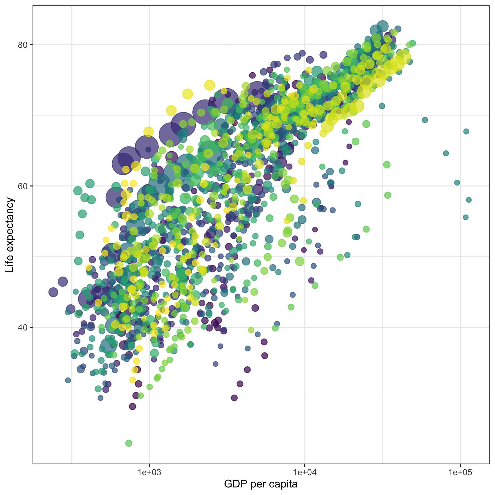
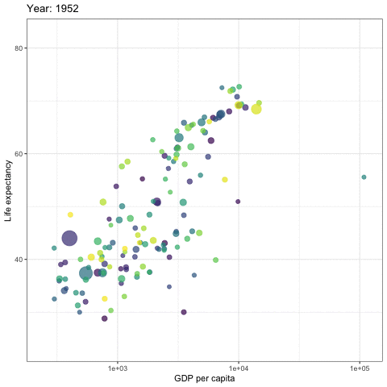
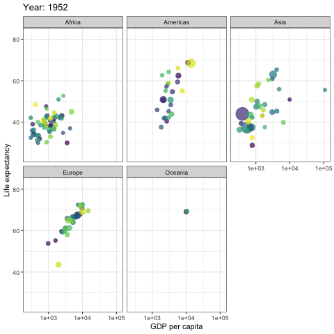
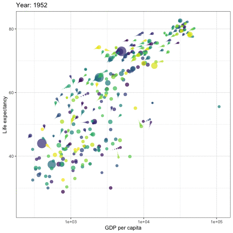
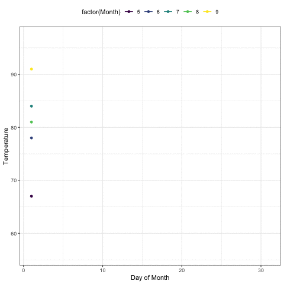
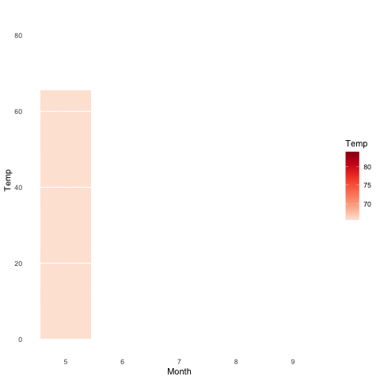

---
output_yaml:
  - _output.yml
---

# Animation {-}

<!-- AR: Every code chunk that creates an animation has eval = FALSE to save on
build time; the book then displays a saved gif (use anim_save()) that is the result of that code chunk. -->

<!-- This section is written by Alboukadel Kassambara and was originally published [here](https://www.datanovia.com/en/blog/gganimate-how-to-create-plots-with-beautiful-animation-in-r/). -->

<!-- Save anim_save(path) to save the gifs in the right location when creating them. By default, they use the last plot. So, just run the code, then use that. -->


**gganimate** is a package for creating animated ggplots. It provides a range of new functionality that can be added to the plot object in order to customize how it should change with time.

Key features of gganimate:

- **transitions**: you want your data to change
- **views**: you want your viewpoint to change
- **shadows**: you want the animation to have memory

## Prerequisites

Load required packages and set the default ggplot2 theme to `theme_bw()`:

```{r}
library(ggplot2)
library(gganimate)
theme_set(theme_bw())
```

## Demo dataset

```{r}
library(gapminder)
head(gapminder)
```

## Static plot

<!-- This code chunk caused lots of trouble. It originally came without the -->
<!-- eval=FALSE. And it works fine on its own. But, it fails if it is placed into -->
<!-- the entire book. I am not sure why! Putting in eval=FALSE makes it OK. But -->
<!-- then I needed to save/show a png of the saved image. It all works. But it is -->
<!-- annoying! And I worry that the error is a sympton of a larger problem. -->

<!--  ggsave("other/images/animation-1.png", p) -->

```{r, cache=TRUE}
p <- ggplot(
  gapminder,
  aes(x = gdpPercap, y=lifeExp, size = pop, colour = country)
  ) +
  geom_point(show.legend = FALSE, alpha = 0.7) +
  scale_color_viridis_d() +
  scale_size(range = c(2, 12)) +
  scale_x_log10() +
  labs(x = "GDP per capita", y = "Life expectancy")
p
```

<!--  -->

## Transition through distinct states in time

### Basics

Key R function: `transition_time()`. The transition length between the states will be set to correspond to the actual time difference between them.

Label variables: `frame_time`. Gives the time that the current frame corresponds to.

```{r, cache=TRUE}
p + transition_time(year) +
  labs(title = "Year: {frame_time}")
```

<!--  -->

Create facets by continent:

```{r, eval = FALSE}
p + facet_wrap(~continent) +
  transition_time(year) +
  labs(title = "Year: {frame_time}")
```



### Let the view follow the data in each frame

```{r, eval = FALSE}
p + transition_time(year) +
  labs(title = "Year: {frame_time}") +
  view_follow(fixed_y = TRUE)
```


### Show preceding frames with gradual falloff

This shadow is meant to draw a small wake after data by showing the latest frames up to the current. You can choose to gradually diminish the size and/or opacity of the shadow. The length of the wake is not given in absolute frames as that would make the animation susceptible to changes in the framerate. Instead it is given as a proportion of the total length of the animation.

```{r, eval = FALSE}
p + transition_time(year) +
  labs(title = "Year: {frame_time}") +
  shadow_wake(wake_length = 0.1, alpha = FALSE)
```



### Show the original data as background marks

This shadow lets you show the raw data behind the current frame. Both past and/or future raw data can be shown and styled as you want.

```{r, eval = FALSE}
p + transition_time(year) +
  labs(title = "Year: {frame_time}") +
  shadow_mark(alpha = 0.3, size = 0.5)
```


## Reveal data along a given dimension

This transition allows you to let data gradually appear, based on a given time dimension.

### Static plot

```{r}
p <- ggplot(
  airquality,
  aes(Day, Temp, group = Month, color = factor(Month))
  ) +
  geom_line() +
  scale_color_viridis_d() +
  labs(x = "Day of Month", y = "Temperature") +
  theme(legend.position = "top")
p
```

### Let data gradually appear

- Reveal by day (x-axis)

```{r, eval = FALSE}
p + transition_reveal(Day)
```


- Show points:

```{r, eval = FALSE}
p + 
  geom_point() +
  transition_reveal(Day)
```



- Points can be kept by giving them a unique group:

```{r, eval = FALSE}
p + 
  geom_point(aes(group = seq_along(Day))) +
  transition_reveal(Day)
```


## Transition between several distinct stages of the data

Data preparation:

```{r}
library(dplyr)
mean.temp <- airquality %>%
  group_by(Month) %>%
  summarise(Temp = mean(Temp))
mean.temp
```

Create a bar plot of mean temperature:

```{r}
p <- ggplot(mean.temp, aes(Month, Temp, fill = Temp)) +
  geom_col() +
  scale_fill_distiller(palette = "Reds", direction = 1) +
  theme_minimal() +
  theme(
    panel.grid = element_blank(),
    panel.grid.major.y = element_line(color = "white"),
    panel.ontop = TRUE
  )
p
```

- transition_states():

```{r, eval = FALSE}
p + transition_states(Month, wrap = FALSE) +
  shadow_mark()
```



- enter_grow() + enter_fade()

```{r, eval = FALSE}
p + transition_states(Month, wrap = FALSE) +
  shadow_mark() +
  enter_grow() +
  enter_fade()
```


<!-- ### Save animation -->

<!-- If you need to save the animation for later use you can use the ``anim_save()`` function. -->

<!-- It works much like ``ggsave()`` from ggplot2 and automatically grabs the last rendered animation if you do not specify one directly. -->

<!-- Example of usage: -->

<!-- AR: the blog post has no example so I wrote a different section below called "How to save your animation" -->

## Read more

- [gganimate official documentation website](https://gganimate.com/index.html)

## How to save your animation

The code to create animations can take a long time to run.  So after you have created an animation, you'll want to save it somewhere so you can display it without having to run the code.  

<!-- AR: if ggsave() is not discussed before now, it may be helpful to add. -->

The key function to use is `anim_save()`, which is very similar to saving static plots using `ggsave()`.  It will save your animation as a gif.  The first argument is the filename you want to give the animation and the second is the animation object, so if you have an animation object called `p` that you wanted to save in a file called "p.gif", you would save it like so:

```{r, eval = FALSE}
anim_save("p.gif", p)
```

If you don't supply the second argument, `anim_save()` will default to saving the most recent animation you rendered.  So `anim_save("animation.gif")` will save the most recent animation as "animation.gif".

If you don't want to save your gif in the current directory, you can specify a directory using the `path` argument. Let's say there is a subdirectory of your working directory called "gifs".  You can thus save "animation.gif" in "gifs" with `anim_save("animation.gif", path = "gifs")`.

After you have created a gif, you can post it online.  You can post it to Facebook by selecting "Photo/Video" on your Facebook status or to Twitter by clicking the [photo icon](https://help.twitter.com/en/using-twitter/tweeting-gifs-and-pictures).
