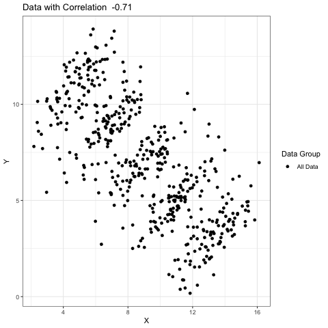

```{r, include = FALSE}
knitr::opts_chunk$set(fig.width = 6, message = F, warning = F, 
                      comment = "", cache = F)
library(tidyverse)
library(xaringan)

```


```{r fake_data_generation, include = FALSE}

# set seed

set.seed(100)

## simulate data with 100 datapoints centered around means (11,3), (9,5), (7,7) with sigma specified by the matrix

N <- 100
Sigma <- matrix(c(1,0.75,0.75, 1), 2, 2)*1.5
means <- list(c(11,5), c(9,7), c(7,9), c(5,11), c(13,3))


# for each mean value, do 100 draws from a multivariate normal distribution
# centered about the specific mean for each component of the mean point

dat <- lapply(means, function(mu) 
  MASS::mvrnorm(N, mu, Sigma))

#  extract the data centered around each of the means from dat, assign it a
#  group, and make it its own dataframe

new_data_1 <- as.data.frame(dat[1]) %>%
  mutate(group = 1)
new_data_2 <- as.data.frame(dat[2]) %>%
  mutate(group = 2)
new_data_3 <- as.data.frame(dat[3]) %>%
  mutate(group = 3)
new_data_4 <- as.data.frame(dat[4]) %>%
  mutate(group = 4)
new_data_5 <- as.data.frame(dat[5]) %>%
  mutate(group = 5)

# bind the rows together into one dataframe 

new <- rbind(new_data_1, new_data_2)
new <- rbind(new, new_data_3)
new <- rbind(new, new_data_4)
new <- rbind(new, new_data_5)


# repeat the process to create a duplicate set of all data with the same id to represent the aggregate data

all_new_data_1 <- as.data.frame(dat[1]) %>%
  mutate(group = 6)
all_new_data_2 <- as.data.frame(dat[2]) %>%
  mutate(group = 6)
all_new_data_3 <- as.data.frame(dat[3]) %>%
  mutate(group = 6)
all_new_data_4 <- as.data.frame(dat[4]) %>%
  mutate(group = 6)
all_new_data_5 <- as.data.frame(dat[5]) %>%
  mutate(group = 6)

all_data <- rbind(all_new_data_1, all_new_data_2)
all_data <- rbind(all_data, all_new_data_3)
all_data <- rbind(all_data, all_new_data_4)
all_data <- rbind(all_data, all_new_data_5)

# combine the data with the group ids and the aggregate id for one final dataset

new <- rbind(all_data, new) %>%
  mutate(group = as.factor(group))

```


```{r plot_codes, include = FALSE}

# Plot 1: plot aggregate data
p1 <- new %>%
  filter(group == 6) %>%
  ggplot(aes(X1, X2)) +
  geom_point(aes(color = group)) +
  ggtitle(paste("Data with Correlation ", toString(round(cor(new$X1,new$X2),2)))) +
  xlab("X") +
  ylab("Y") +
  theme_bw() +
  scale_color_manual(values = c("black"), labels = c("All Data")) +
  labs(color = "Data Group")


# calculate correlations for the groups

correlations <- new %>%
  filter(group != "6") %>%
  group_by(group) %>%
  summarise(cor(X1,X2)) %>%
  pull() %>%
  round(2) 


# plot the groups colored by group with correlations in title 

p2a <-  new %>%
  filter(group != "6") %>%
  ggplot(aes(X1, X2)) +
  geom_point(aes(color = as.factor(group))) +
  ggtitle(paste("Correlations = ",toString(correlations))) +
  xlab("X") +
  ylab("Y") +
  theme_bw() +
  labs(color = "Data Group")

# add linear regression lines to the groups plot

p2 <- new %>%
  filter(group != "6") %>%
  ggplot(aes(X1, X2)) +
  geom_point(aes(color = as.factor(group))) +
  geom_smooth(aes(color = as.factor(group)), method = "lm", se = F) +
  ggtitle(paste("Correlations = ",toString(correlations))) +
  xlab("X") +
  ylab("Y") +
  theme_bw() +
  labs(color = "Data Group")

# add a linear regression line to the aggregate data plot

p3 <- new %>%
  filter(group == 6) %>%
  ggplot(aes(X1, X2)) +
  geom_point(aes(color = group)) +
  geom_smooth(color = "black", method = "lm", se = F) +
  ggtitle(paste("Data with Correlation ", toString(round(cor(new$X1,new$X2),2)))) +
  xlab("X") +
  ylab("Y") +
  theme_bw() +
  scale_color_manual(values = c("black"), labels = c("All Data")) +
  labs(color = "Data Group")


```


```{r fake_paradox_gif, include = FALSE}

# create the gif of the data using the animation package to switch between the plots

animation::saveGIF(
  expr = {
    plot(p1)
    plot(p2a)
    plot(p2)
    plot(p3)
  },
  
  # change the interval between the images
  
  interval = 2,
  movie.name = "fake_paradox.gif"  

)
```

class: title-slide, center

# What is Simpson's Paradox?

<!-- embed the gif -->

<center>



---

<!-- create a left column -->

.pull-left[

```{r include_plot_1, echo = FALSE}
p1
```

] 

<!-- create a right column -->

.pull-right[

#Consider the data X,Y plotted to the left.


{{content}}
]
--
+ The relationship between X and Y is clearly negative and the correlation is -.34.

{{content}}
--
## We can visualize the relationship between these two variables by adding a simple linear regression line

---
<!-- create a left column -->

.pull-left[

```{r include_plot_3, echo = FALSE}
p3
```

] 

<!-- create a right column -->

.pull-right[

#Consider the data X,Y plotted to the left.
+ The relationship between X and Y is clearly negative and the correlation is -.34.

## We can visualize the relationship between these two variables by adding a simple linear regression line

]


---

<!-- create a left column -->

.pull-left[

```{r include_plot__again, echo = FALSE}
p3
```

] 

<!-- create a right column -->

.pull-right[

#But what happens when we consider the aggregate data in its natural groupings?


]


---

<!-- create a left column -->

.pull-left[

```{r include_plot_2a, echo = FALSE}
p2a
```

] 

<!-- create a right column -->

.pull-right[

# Revealing the 5 Data Subgroups

]


---

<!-- create a left column -->

.pull-left[

```{r include_plot_2, echo = FALSE}
p2
```

] 

<!-- create a right column -->

.pull-right[

# Revealing the 5 Data Subgroups
+ Adding a simple linear regression line here for each of the groups makes it clear that the apparent negative trend between X and Y when the data was aggregated is now positive within each group

]


---

# Visualizing Simpson's Paradox: An Animated Gif

<!-- create a left column -->

.pull-left[

<!-- include gif -->


]

<!-- create a right column -->

.pull-right[

## Caution: Same Data, Opposite Interpretations!

Simpson’s Paradox is a statistical phenomenon in which trends for data in the aggregate either disappear or are reversed when the data are broken down into groups. Simpson’s Paradox is a phenomenon that is frequently encountered in social science and medical science research. The tricky thing about Simpson’s Paradox is that it can mean that vastly different interpretations can be taken from the same data - thus, it's critical to understand how and why it occurs so that we don't make inappropriate conculsions from data!
]
